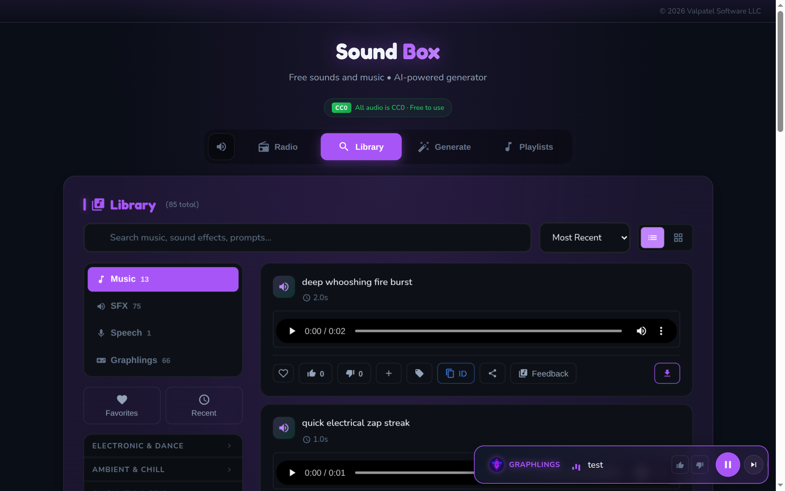
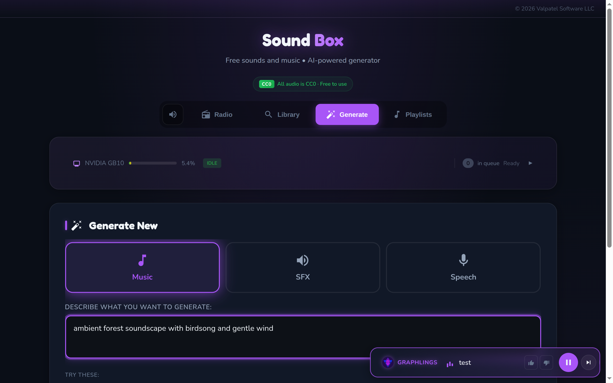
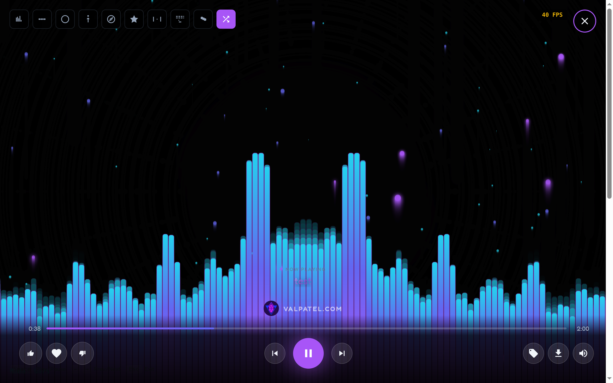

# Sound Box

AI audio generation server with multiple engines, a community library, and a game asset review workflow.


## Features

### Generation Engines
- **MusicGen** — Original music from text prompts (Meta AI)
- **AudioGen** — Sound effects and ambient audio from text prompts (Meta AI)
- **MAGNeT** — Fast non-autoregressive music and SFX generation (Meta AI)
- **Piper TTS** — Natural text-to-speech with 20+ downloadable voices (Rhasspy)

### Listening & Discovery
- **Radio Stations** — Continuous playback across genre stations with skip, vote, and favorite
- **10 Visualizer Modes** — Bars, wave, circle, particles, lissajous, tempest, pong, breakout, snake, random
- **Library & Search** — Full-text search, filtering by type, sorting, voting, favorites, playlists

### Tagging & Review
- **Game Asset Tagging** — Tag generated audio for specific games or apps via API or MCP tools
- **Review Workflow** — Thumbs-up/down voting with structured feedback: reviewers select rejection reasons and leave notes so sounds can be regenerated to spec

### Infrastructure
- **Smart Queue** — Priority-based job processing with model affinity and tier limits
- **Quality Analysis** — Automatic scoring with retry on low quality
- **Service Discovery** — mDNS, MCP tools, A2A agent card, OpenAPI spec
- **Open Access Mode** — Zero-login usage with IP-based identity
- **Multi-Platform** — x86_64 desktop, Jetson Orin, DGX Grace/Blackwell

## Screenshots

| Radio | Library |
|:---:|:---:|
|  |  |

| Generate | Visualizer |
|:---:|:---:|
|  |  |

## Quick Start

```bash
git clone https://github.com/Valpatel/app-soundbox.git
cd app-soundbox
./setup.sh          # Install dependencies (auto-detects platform)
./start.sh          # Start server
```

Open **http://localhost:5309**

Optional: auto-start on boot with systemd:

```bash
./scripts/service.sh install   # Installs soundbox + MCP + mDNS services
```

## Requirements

- Python 3.10+
- NVIDIA GPU with 8GB+ VRAM (for music/SFX generation)
- FFmpeg

> TTS works without a GPU. Music/SFX generation requires CUDA.

## Documentation

Full docs are in the [`docs/`](docs/) directory:

- [Getting Started](docs/GETTING-STARTED.md) — Installation, configuration, first run
- [Architecture](docs/ARCHITECTURE.md) — System design, components, data flow
- [API Reference](docs/api/README.md) — Endpoints, authentication, rate limits
- [Frontend](docs/frontend/README.md) — UI components, radio widget
- [Operations](docs/operations/deployment.md) — Deployment, backup, monitoring
- [Service Discovery](docs/systems/service-discovery.md) — mDNS, MCP, A2A, OpenAPI

## Configuration

Copy `.env.example` to `.env`:

```bash
cp .env.example .env
```

| Variable | Default | Description |
|----------|---------|-------------|
| `HOST` | `0.0.0.0` | Server bind address |
| `PORT` | `5309` | Server port |
| `OPEN_ACCESS_MODE` | `true` | Disable login requirements |
| `IP_WHITELIST` | *(empty)* | Comma-separated IPs for creator-tier limits |
| `MCP_PORT` | `5310` | MCP server port (SSE transport) |
| `BACKUP_DIR` | *(disabled)* | Enable nightly backups |

## API Quick Reference

```bash
# Generate audio
curl -X POST http://localhost:5309/generate \
  -H "Content-Type: application/json" \
  -d '{"prompt": "upbeat electronic music", "duration": 10, "model": "music"}'

# Check job status
curl http://localhost:5309/job/<job_id>

# Search library
curl "http://localhost:5309/api/library?q=ambient&model=audio"

# Service discovery
curl http://localhost:5309/api/manifest
curl http://localhost:5309/.well-known/agent-card.json
curl http://localhost:5309/openapi.json
```

See [API Documentation](docs/api/README.md) for the complete reference.

## Tech Stack

Flask, PyTorch, AudioCraft (MusicGen, AudioGen, MAGNeT), Piper TTS, SQLite (FTS5), vanilla JS, Web Audio API, Avahi mDNS, MCP, OpenAPI 3.1

## License

AGPL v3 — See [LICENSE](LICENSE) for details.

## Credits

Created by Matthew Valancy

- [AudioCraft](https://github.com/facebookresearch/audiocraft) by Meta AI
- [Piper](https://github.com/rhasspy/piper) by Rhasspy

(c) 2026 Valpatel Software LLC
