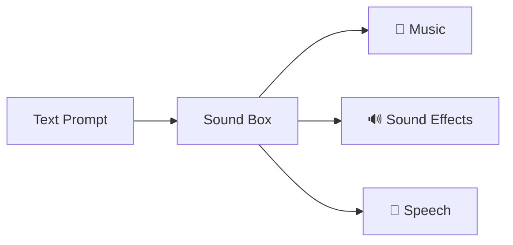

# Sound Box

AI-powered audio generation server built on Meta's AudioCraft and Piper TTS. Generate music, sound effects, and speech from text prompts.



## Features

- **Music Generation** - Original music from text using MusicGen
- **Sound Effects** - Ambient sounds and SFX using AudioGen
- **Text-to-Speech** - Natural voices with Piper TTS (20+ voices)
- **Smart Queue** - Priority-based job processing with tier limits
- **Quality Analysis** - Automatic scoring with retry on low quality
- **Library & Search** - Full-text search, voting, playlists
- **Radio Mode** - Continuous playback with visualizers
- **Automated Backups** - Nightly backups with tiered retention

## Quick Start

```bash
git clone git@github.com:Valpatel/app-soundbox.git
cd app-soundbox
./setup.sh    # Install dependencies
./start.sh    # Start server
```

Open **http://localhost:5309**

## Requirements

- Python 3.10+
- NVIDIA GPU with 8GB+ VRAM (for music/SFX generation)
- FFmpeg

> **Note**: TTS works without a GPU. Music/SFX generation requires CUDA.

## Documentation

| Document | Description |
|----------|-------------|
| [Getting Started](docs/GETTING-STARTED.md) | Installation, configuration, first run |
| [Architecture](docs/ARCHITECTURE.md) | System design, components, data flow |
| **API Reference** | |
| ↳ [Overview](docs/api/README.md) | Authentication, rate limits |
| ↳ [Generation](docs/api/generation.md) | /generate, /status, /queue |
| ↳ [Library](docs/api/library.md) | Search, vote, favorites |
| ↳ [Playlists](docs/api/playlists.md) | Create, manage playlists |
| ↳ [TTS](docs/api/tts.md) | Voice synthesis |
| **Systems** | |
| ↳ [Audio Generation](docs/systems/audio-generation.md) | Models, pipeline, quality |
| ↳ [Queue System](docs/systems/queue-system.md) | Priority, scheduling |
| ↳ [Database](docs/systems/database.md) | Schema, categories, search |
| ↳ [Authentication](docs/systems/authentication.md) | Auth flow, tiers |
| **Frontend** | |
| ↳ [Overview](docs/frontend/README.md) | UI components |
| ↳ [Radio Widget](docs/frontend/radio-widget.md) | Embeddable player |
| **Operations** | |
| ↳ [Deployment](docs/operations/deployment.md) | Production setup |
| ↳ [Backup](docs/operations/backup.md) | Backup & restore |
| ↳ [Monitoring](docs/operations/monitoring.md) | Health, metrics |

## Configuration

Copy `.env.example` to `.env`:

```bash
cp .env.example .env
```

| Variable | Default | Description |
|----------|---------|-------------|
| `HOST` | `0.0.0.0` | Server bind address |
| `PORT` | `5309` | Server port |
| `BACKUP_DIR` | *(disabled)* | Enable nightly backups |
| `BACKUP_TIME` | `03:00` | Backup schedule (24h) |

## API Quick Reference

### Generate Audio
```bash
curl -X POST http://localhost:5309/generate \
  -H "Content-Type: application/json" \
  -d '{"prompt": "upbeat electronic music", "duration": 10, "model": "music"}'
```

### Check Status
```bash
curl http://localhost:5309/job/<job_id>
```

### Search Library
```bash
curl "http://localhost:5309/api/library?q=ambient&model=audio"
```

See [API Documentation](docs/api/README.md) for complete reference.

## Project Structure

```
app-soundbox/
├── app.py              # Flask server (4,400 lines)
├── database.py         # SQLite + FTS5 layer
├── backup.py           # Automated backup system
├── templates/
│   └── index.html      # Frontend SPA
├── static/js/          # Radio widget modules
├── models/voices/      # Piper TTS voice models
├── generated/          # Output audio files
├── docs/               # Documentation
└── tests/              # Playwright E2E tests
```

## Models

| Model | VRAM | Use Case |
|-------|------|----------|
| MusicGen | 4GB | Background music, loops |
| AudioGen | 5GB | Sound effects, ambience |
| MAGNeT | 6GB | Experimental generation |
| Piper TTS | 0.5GB | Speech synthesis |

## Tech Stack

- **Backend**: Flask, PyTorch, AudioCraft, Piper TTS
- **Database**: SQLite with FTS5 full-text search
- **Frontend**: Vanilla JS, Web Audio API
- **Queue**: Python threading with priority queue

## License

MIT License - See [LICENSE](LICENSE) for details.

## Credits

- [AudioCraft](https://github.com/facebookresearch/audiocraft) by Meta AI
- [Piper](https://github.com/rhasspy/piper) by Rhasspy
- [Graphlings.net](https://graphlings.net) platform integration
