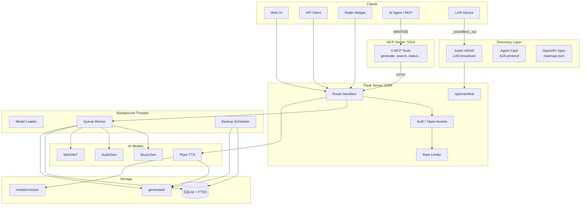
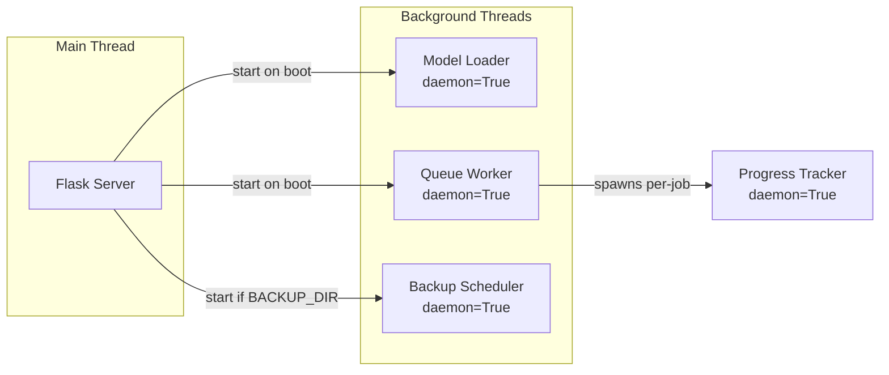
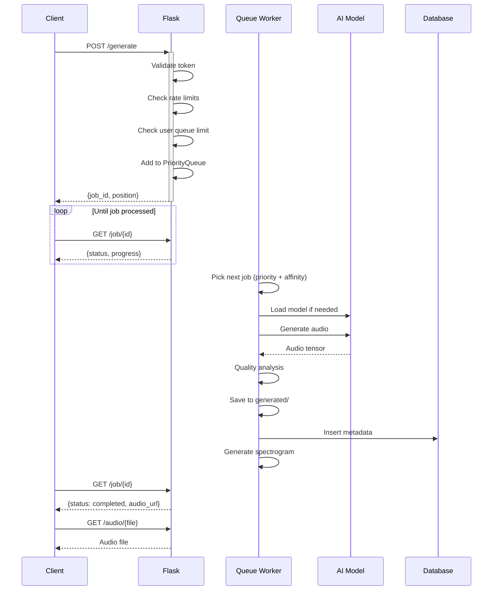
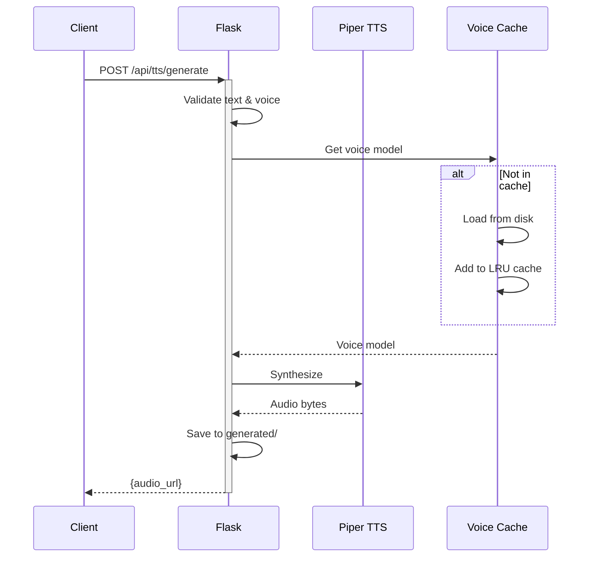
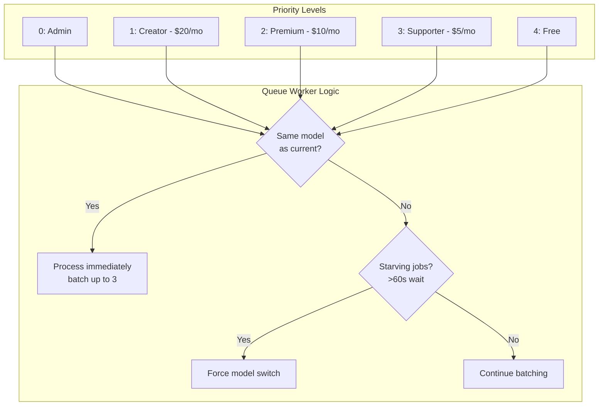
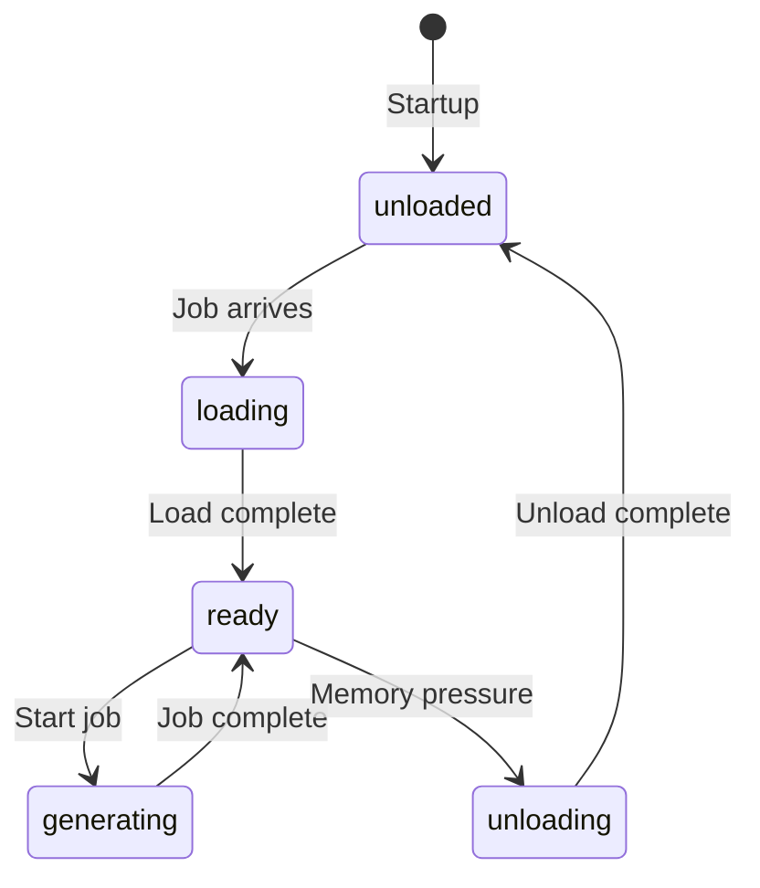
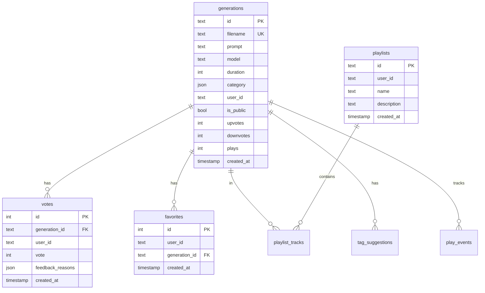
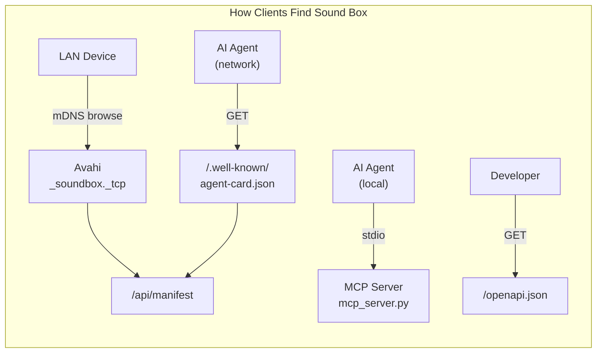
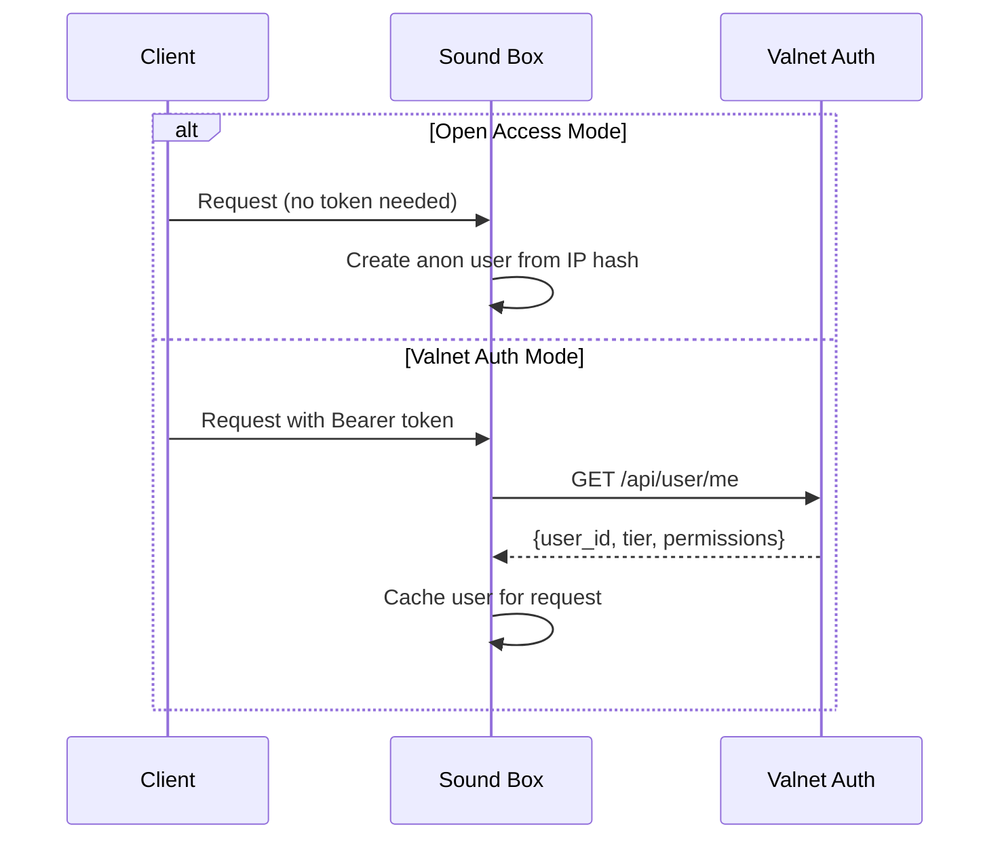

# Architecture Overview

How Sound Box works internally. Use this guide to understand the system before diving into specific components.



## Core Components

### Flask Application (`app.py`)

The main entry point (~4,800 lines). Handles:

- **HTTP Routes** - REST API endpoints for all operations
- **Authentication** - Open Access Mode (anonymous IP) or Bearer token via Valnet
- **Rate Limiting** - Per-endpoint and per-tier limits using Flask-Limiter
- **Job Submission** - Validates requests, adds to priority queue
- **Static Serving** - Audio files, spectrograms, widget assets
- **Service Discovery** - `/api/manifest`, `/.well-known/agent-card.json`, `/openapi.json`

### MCP Server (`mcp_server.py`)

Separate process exposing Sound Box as MCP tools for AI agents:

- **6 Tools** - generate_audio, check_job, search_library, get_status, get_radio_track, download_audio
- **Transports** - stdio (local agents via `.mcp.json`) or SSE (network agents on `:5310`)
- **Proxies to Flask** - All tool invocations translate to HTTP calls to the main server
- **Security** - X-MCP-Proxy header, MCP_API_KEY for SSE, input validation, SSE localhost binding

### Database Layer (`database.py`)

SQLite with FTS5 full-text search (~800 lines). Provides:

- **Schema Management** - Tables, indexes, migrations
- **CRUD Operations** - Generations, votes, playlists
- **Full-Text Search** - FTS5 virtual table for prompt search
- **Category System** - Keyword-based auto-categorization
- **Query Sanitization** - FTS5 injection prevention

### Backup System (`backup.py`)

Automated backup with tiered retention:

- **Database Backup** - SQLite's backup command (safe while running)
- **Audio Sync** - rsync with hardlinks to previous backup
- **Retention Policy** - 14 days daily, then weekly for 2 months

---

## Threading Model

Sound Box uses multiple background threads for concurrent operations.



| Thread | Purpose | Lifecycle |
|--------|---------|-----------|
| Main | Flask web server, handles all HTTP | Process lifetime |
| Model Loader | Preloads commonly-used AI models on startup | Exits after loading |
| Queue Worker | Processes generation jobs from priority queue | Process lifetime |
| Progress Tracker | Updates job progress during generation | Per-job, exits on completion |
| Backup Scheduler | Runs nightly backups via APScheduler | Process lifetime (if enabled) |

### Thread Safety

- `queue_lock` - Protects `jobs` dict and job state transitions
- `model_lock` - Protects model loading/unloading operations
- `voice_models_lock` - Protects TTS voice model cache

---

## Request Flow

### Audio Generation



### Text-to-Speech

TTS bypasses the queue for instant response:



---

## Priority Queue System

Jobs are processed based on subscription tier with model affinity optimization.



### Model Affinity

The queue worker prefers jobs matching the currently-loaded model to avoid expensive model switches:

1. **Batch Processing** - Process up to 3 jobs of same model type
2. **Starvation Prevention** - Force switch after 60s of same-model jobs
3. **Priority Override** - Higher priority always wins within batch

### Queue Skip (Aura)

Users can pay Aura (in-app currency) to skip the queue:

| Duration | Cost |
|----------|------|
| 1-10s | 1 Aura |
| 11-30s | 3 Aura |
| 31-60s | 5 Aura |
| 61-120s | 10 Aura |
| 121s+ | 15 Aura |

---

## AI Models

### Model Specifications

| Model | Type | VRAM | Use Case |
|-------|------|------|----------|
| MusicGen | Music | 4GB | Background music, melodies, loops |
| AudioGen | SFX | 5GB | Sound effects, ambience, nature |
| MAGNeT | Experimental | 6GB | Alternative generation algorithm |
| Piper TTS | Speech | 0.5GB | Voiceovers, narration |

### On-Demand Loading

Models are loaded only when needed to conserve GPU memory:



- **Preloading** - AudioGen preloaded if 5GB+ free VRAM
- **Idle Timeout** - Models unloaded after extended inactivity
- **Memory Check** - Uses nvidia-smi to detect other GPU consumers (e.g., Ollama)

### Quality Analysis

Generated audio is analyzed before saving:

```
Quality checks performed:
1. Clipping detection (>5% samples near +/-1.0)
2. Silence detection (RMS < 0.005)
3. High-frequency noise (>14kHz energy ratio)
4. Spectral flatness (pure noise detection)

Score 0-100, retry if score < 50
```

---

## Database Schema



### Full-Text Search

FTS5 virtual table for fast prompt searching:

```sql
-- Virtual table for full-text search
CREATE VIRTUAL TABLE IF NOT EXISTS generations_fts
USING fts5(prompt, content=generations, content_rowid=rowid);

-- Triggers keep FTS in sync with main table
```

### Category System

Auto-categorization based on prompt keywords:

- **Music Categories** - 50+ categories (genres, moods, instruments)
- **SFX Categories** - 30+ categories (UI, actions, environment)
- **Speech Categories** - Voice characteristics, languages

---

## File Structure

```
app-soundbox/
├── app.py              # Flask server (~4,800 lines)
├── mcp_server.py       # MCP server for AI agent tool use
├── database.py         # SQLite layer, FTS5, categories
├── backup.py           # Automated backup system
├── voice_licenses.py   # TTS voice attribution data
├── .env                # Configuration (not in repo)
├── .mcp.json           # Claude Code MCP auto-discovery
│
├── start.sh            # Start server (uses venv)
├── setup.sh            # Multi-platform setup (x86_64/ARM64)
├── service.sh          # Systemd service management
│
├── avahi/
│   └── soundbox.service  # mDNS LAN discovery (XML)
│
├── templates/
│   └── index.html      # Main SPA (~15,000 lines)
│
├── static/
│   ├── js/             # Radio widget modules
│   ├── openapi.json    # OpenAPI 3.1 spec
│   └── ...
│
├── models/voices/      # Piper TTS voice models (~2GB)
├── generated/          # Output audio files (WAV)
├── spectrograms/       # Waveform images (PNG)
├── soundbox.db         # SQLite database
│
├── tests/              # Playwright E2E tests (19 suites)
└── docs/               # This documentation
```

---

## Service Discovery

Five discovery layers allow different client types to find and interact with Sound Box.



| Layer | Endpoint / Protocol | Purpose |
|-------|---------------------|---------|
| Avahi mDNS | `_soundbox._tcp` broadcast | Zero-config LAN discovery |
| Manifest | `GET /api/manifest` | Universal capabilities hub |
| Agent Card | `GET /.well-known/agent-card.json` | A2A agent protocol |
| MCP Server | stdio or SSE `:5310` | Direct AI tool invocation |
| OpenAPI | `GET /openapi.json` | Machine-readable API spec |

See [Service Discovery](systems/service-discovery.md) for detailed documentation.

---

## Authentication & Open Access

Sound Box supports two auth modes:

- **Open Access Mode** (`OPEN_ACCESS_MODE=true`, default) - No login required. Anonymous users get IP-based identity. Rate limits enforced per-IP. `IP_WHITELIST` for elevated limits. Localhost exempt except MCP-proxied requests.
- **Valnet Auth** (`OPEN_ACCESS_MODE=false`) - Bearer token validation against external auth service. Tier-based limits (Creator, Premium, Supporter, Free).

---

## Security

### Input Validation

- **Prompt Sanitization** - Length limits, character filtering
- **FTS5 Query Sanitization** - Prevents query injection
- **Path Traversal Prevention** - Filename validation

### Rate Limiting

Per-tier limits enforced by Flask-Limiter:

| Tier | Generations/Hour | Max Duration | Context |
|------|------------------|--------------|---------|
| Creator | 60 | 180s | Whitelisted IPs or paid tier |
| Premium | 30 | 120s | Paid tier |
| Supporter | 15 | 60s | Paid tier |
| Free | 10 | 60s | Open Access default |

### Headers

Security headers applied to all responses:

```
X-Content-Type-Options: nosniff
X-Frame-Options: SAMEORIGIN
X-XSS-Protection: 1; mode=block
Referrer-Policy: strict-origin-when-cross-origin
Content-Security-Policy: [configured for app needs]
```

### MCP Security

The MCP server has dedicated security hardening:

- **X-MCP-Proxy header** - MCP server tags all forwarded requests; Flask denies localhost privileges to these
- **SSE localhost binding** - SSE transport binds to `127.0.0.1` only (not `0.0.0.0`)
- **MCP_API_KEY** - Required Bearer token for SSE connections; stdio always trusted
- **Input validation** - Hex regex for IDs, parameter clamping for durations/pagination
- **Manifest redaction** - `/api/manifest` omits hostname, GPU name, MCP port

---

## External Dependencies

### Authentication (Valnet / Open Access)

In Open Access Mode (default), no external auth is needed - users are identified by IP hash.

When Open Access is disabled, tokens are validated against Valnet:



### Graphlings Integration

Optional integration for platform-specific features (disabled in Open Access Mode):

- **User Profiles** - Link generations to Graphlings accounts
- **Aura Payments** - Virtual currency for queue skipping
- **Source Attribution** - Track which platform requested generation

---

## Performance Considerations

### GPU Memory Management

- Check system-wide free memory before loading models
- Unload idle models when memory pressure detected
- Skip preloading if other GPU consumers present (Ollama, etc.)

### Database

- Indexed columns for common queries
- FTS5 for fast text search (no LIKE scans)
- WAL mode for concurrent reads during writes

### Caching

- Voice models cached with LRU eviction (max 10)
- User auth cached per-request (not globally)
- Rate limit state stored in-memory

---

## Key Design Decisions

| Decision | Rationale |
|----------|-----------|
| **Single-File Frontend** | No build step, simpler deployment, fast iteration |
| **SQLite + FTS5** | Built-in full-text search, no external dependencies |
| **Priority Queue** | Fair processing with tier-based prioritization |
| **Auto-Retry on Poor Quality** | Prevents bad generations from polluting library |
| **Crowdsourced Categorization** | Community improves metadata, consensus required |
| **Private Feedback** | No public comments, maintains quality discussion |
| **On-Demand Model Loading** | Conserves GPU memory when not actively generating |
| **Open Access by Default** | Zero-friction usage, auth still available if needed |
| **5-Layer Discovery** | Different clients need different protocols (mDNS, MCP, A2A, OpenAPI) |
| **MCP as Separate Process** | Isolate AI agent tooling from main server, independent scaling |

---

## See Also

- [Queue System](systems/queue-system.md) - Priority scheduling deep dive
- [Audio Generation](systems/audio-generation.md) - Model details, quality analysis
- [Database](systems/database.md) - Schema, categories, migrations
- [Service Discovery](systems/service-discovery.md) - mDNS, manifest, MCP, OpenAPI, A2A
- [Authentication](systems/authentication.md) - Auth flow, tiers, Open Access Mode
- [API Reference](api/README.md) - Complete endpoint documentation

---

[← Back to README](../README.md)
