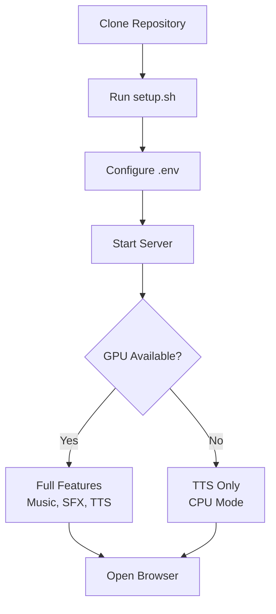

# Getting Started

Get Sound Box running in 10 minutes.



## Prerequisites

### Required
- **Python 3.10+**
- **FFmpeg** - Audio processing
- **8GB RAM** minimum

### For Music/SFX Generation
- **NVIDIA GPU** with 8GB+ VRAM
- **CUDA 12.1** or compatible
- **Linux** (Ubuntu 22.04 recommended)

> **TTS Only Mode**: If you don't have a GPU, Sound Box still works for text-to-speech using CPU.

## Installation

### Option 1: Automatic Setup (Recommended)

```bash
# Clone the repository
git clone git@github.com:Valpatel/app-soundbox.git
cd app-soundbox

# Run setup script (may require sudo for system deps)
chmod +x setup.sh
./setup.sh
```

The setup script will:
1. Detect platform (x86_64, ARM64 Jetson, ARM64 DGX/Blackwell)
2. Install system dependencies (ffmpeg, avahi, etc.)
3. Create Python virtual environment
4. Install PyTorch with CUDA support (platform-specific wheels)
5. Install AudioCraft, Piper TTS, and MCP SDK
6. Download voice models (~2GB)
7. Initialize the database

### Option 2: Manual Setup

```bash
# System dependencies (Ubuntu/Debian)
sudo apt-get update
sudo apt-get install -y python3 python3-venv python3-pip ffmpeg \
    libavformat-dev libavcodec-dev libavdevice-dev libavutil-dev \
    libavfilter-dev libswscale-dev libswresample-dev pkg-config

# Create virtual environment
python3 -m venv venv
source venv/bin/activate

# Install PyTorch (with CUDA)
pip install torch torchaudio --index-url https://download.pytorch.org/whl/cu121

# Install dependencies
pip install -r requirements.txt

# Initialize database
python -c "import database; database.init_db()"
```

## Configuration

Copy the example configuration:

```bash
cp .env.example .env
```

Edit `.env` with your settings:

```bash
# Server Settings
HOST=0.0.0.0          # Bind address (0.0.0.0 for all interfaces)
PORT=5309             # Server port
FLASK_DEBUG=false     # Enable debug mode (not for production)

# Backup Settings (optional)
BACKUP_DIR=/path/to/backups   # Enable nightly backups
BACKUP_TIME=03:00             # Backup time (24h format)
```

### Key Configuration Options

| Variable | Default | Description |
|----------|---------|-------------|
| `HOST` | `0.0.0.0` | Network interface to bind |
| `PORT` | `5309` | HTTP port |
| `OPEN_ACCESS_MODE` | `true` | No login required (anonymous IP identity) |
| `IP_WHITELIST` | *(empty)* | Comma-separated IPs for creator-tier limits |
| `MCP_PORT` | `5310` | MCP server port for AI agent integration |
| `FLASK_DEBUG` | `false` | Auto-reload on code changes |
| `BACKUP_DIR` | *(none)* | Directory for nightly backups |
| `BACKUP_TIME` | `03:00` | When to run backups |

## Starting the Server

```bash
./start.sh
```

Or manually:

```bash
source venv/bin/activate
python app.py
```

You'll see:

```
Starting server... Models loading in background.
Backup scheduler started - daily at 03:00
Access at http://localhost:5309
```

Open **http://localhost:5309** in your browser.

## First Generation

### Using the Web UI

1. Open Sound Box in your browser
2. Enter a prompt: "relaxing ambient music with gentle piano"
3. Select model: **Music**
4. Set duration: **10 seconds**
5. Click **Generate**

### Using the API

```bash
# Generate music
curl -X POST http://localhost:5309/generate \
  -H "Content-Type: application/json" \
  -d '{
    "prompt": "relaxing ambient music with gentle piano",
    "duration": 10,
    "model": "music"
  }'

# Response
{
  "success": true,
  "job_id": "abc123...",
  "position": 1
}

# Check status
curl http://localhost:5309/job/abc123

# When complete, download audio
curl -O http://localhost:5309/audio/abc123.wav
```

### Text-to-Speech

```bash
curl -X POST http://localhost:5309/api/tts/generate \
  -H "Content-Type: application/json" \
  -d '{
    "text": "Hello, welcome to Sound Box!",
    "voice": "en_US-lessac-medium"
  }'
```

## Verify Installation

Check system status:

```bash
curl http://localhost:5309/status
```

Check service discovery:

```bash
# Service manifest (all capabilities in one JSON)
curl http://localhost:5309/api/manifest | python3 -m json.tool

# AI agent card
curl http://localhost:5309/.well-known/agent-card.json | python3 -m json.tool
```

### Optional: Auto-Start on Boot

```bash
./service.sh install    # Installs soundbox + MCP + mDNS services
./service.sh status     # Verify both services running
```

## Troubleshooting

### Models Won't Load

**Symptom**: Status shows "pending" or "error" for models

**Check GPU memory**:
```bash
nvidia-smi
```

**Solution**: Need at least 4GB free VRAM. Close other GPU applications.

### CUDA Not Detected

**Symptom**: `torch.cuda.is_available()` returns `False`

**Verify CUDA**:
```bash
python -c "import torch; print(torch.cuda.is_available())"
```

**Solutions**:
- Install CUDA 12.1: https://developer.nvidia.com/cuda-downloads
- Reinstall PyTorch: `pip install torch --index-url https://download.pytorch.org/whl/cu121`

### No Audio Output

**Symptom**: Generation completes but file is empty or corrupted

**Check FFmpeg**:
```bash
ffmpeg -version
```

**Solution**: Install FFmpeg: `sudo apt-get install ffmpeg`

### Database Errors

**Symptom**: SQLite errors on startup

**Reset database**:
```bash
rm soundbox.db
python -c "import database; database.init_db()"
```

### Port Already in Use

**Symptom**: `Address already in use` error

**Find and kill process**:
```bash
lsof -i :5309
kill <PID>
```

**Or use different port**:
```bash
PORT=5310 python app.py
```

## Next Steps

- [Architecture Overview](ARCHITECTURE.md) - Understand how Sound Box works
- [API Reference](api/README.md) - Complete API documentation
- [Service Discovery](systems/service-discovery.md) - mDNS, MCP tools, A2A, OpenAPI
- [Audio Generation](systems/audio-generation.md) - Deep dive into models

---

[← Back to README](../README.md)
