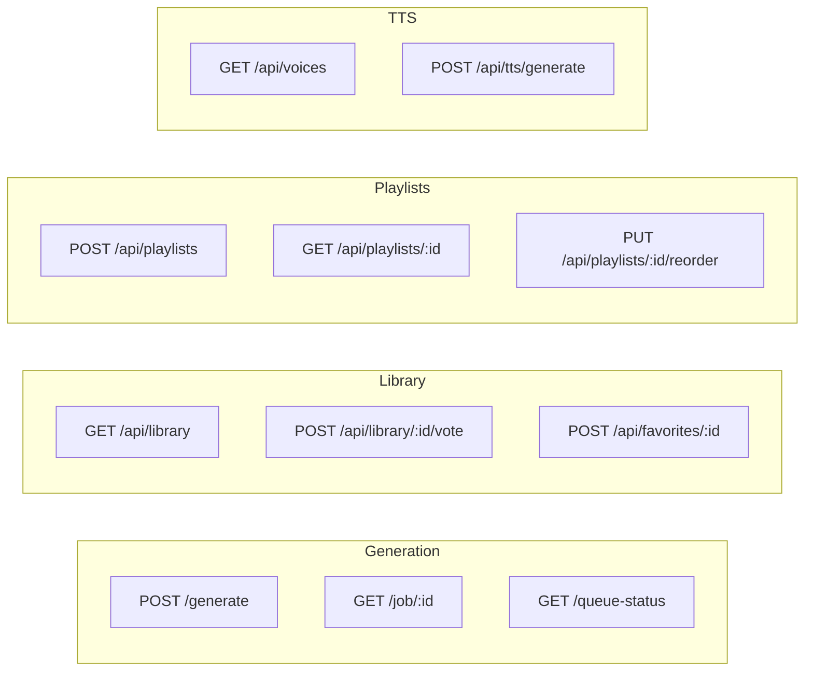

# API Reference

Sound Box REST API for audio generation, library management, and playback.



## Base URL

```
http://localhost:5309
```

Production deployments should use HTTPS via reverse proxy.

## Authentication

Most endpoints require authentication via Bearer token from Valnet/Graphlings.

```bash
# Include token in Authorization header
curl -H "Authorization: Bearer YOUR_TOKEN" \
  http://localhost:5309/api/library
```

### Authentication Levels

| Level | Description | Endpoints |
|-------|-------------|-----------|
| **None** | No auth required | Library browsing, public audio |
| **Optional** | Enhanced features if authenticated | Tag suggestions, radio |
| **Required** | Must be authenticated | Generation, voting, favorites |
| **Owner** | Must own the resource | Cancel job, manage playlists |

### User Tiers

Authentication tokens include subscription tier information:

| Tier | Price | Benefits |
|------|-------|----------|
| Creator | $20/mo | 60 gen/hr, 180s max, 20 queue slots |
| Premium | $10/mo | 30 gen/hr, 120s max, 10 queue slots |
| Supporter | $5/mo | 15 gen/hr, 60s max, 5 queue slots |
| Free | $0 | 3 gen/hr, 30s max, 2 queue slots |

## Rate Limiting

Rate limits are enforced per-endpoint and per-user:

| Endpoint Category | Rate Limit |
|-------------------|------------|
| Library browsing | 300/minute |
| Generation | Per-tier (see above) |
| Voting | 100/hour |
| Favorites | 100/hour |
| Playlist management | 20-200/hour |

Rate limit headers are included in responses:

```
X-RateLimit-Limit: 100
X-RateLimit-Remaining: 99
X-RateLimit-Reset: 1609459200
```

## Common Response Formats

### Success Response

```json
{
  "success": true,
  "data": { ... }
}
```

### Error Response

```json
{
  "error": "Human-readable error message"
}
```

### Paginated Response

```json
{
  "items": [ ... ],
  "page": 1,
  "per_page": 20,
  "total": 150,
  "has_more": true
}
```

## Pagination

List endpoints support pagination:

| Parameter | Default | Max | Description |
|-----------|---------|-----|-------------|
| `page` | 1 | - | Page number (1-indexed) |
| `per_page` | 20 | 100 | Items per page |

## Content Types

- **Request**: `application/json`
- **Response**: `application/json` (data) or `audio/wav` (files)

## API Sections

| Section | Description |
|---------|-------------|
| [Generation](generation.md) | Submit jobs, check status, manage queue |
| [Library](library.md) | Browse, search, vote, favorites |
| [Playlists](playlists.md) | Create and manage playlists |
| [TTS](tts.md) | Text-to-speech synthesis |

---

## Quick Examples

### Generate Audio

```bash
# Submit a generation job
curl -X POST http://localhost:5309/generate \
  -H "Authorization: Bearer $TOKEN" \
  -H "Content-Type: application/json" \
  -d '{
    "prompt": "upbeat electronic music with synths",
    "duration": 10,
    "model": "music"
  }'

# Response
{
  "job_id": "abc123...",
  "position": 3,
  "status": "queued"
}
```

### Check Job Status

```bash
curl -H "Authorization: Bearer $TOKEN" \
  http://localhost:5309/job/abc123

# Response (when complete)
{
  "status": "completed",
  "audio_url": "/audio/abc123.wav",
  "spectrogram_url": "/spectrogram/abc123.png"
}
```

### Search Library

```bash
curl "http://localhost:5309/api/library?q=ambient&model=audio"

# Response
{
  "items": [
    {
      "id": "def456",
      "prompt": "ambient forest sounds with birds",
      "model": "audio",
      "duration": 15,
      "upvotes": 12,
      "downvotes": 1
    }
  ],
  "total": 47,
  "page": 1
}
```

### Text-to-Speech

```bash
curl -X POST http://localhost:5309/api/tts/generate \
  -H "Authorization: Bearer $TOKEN" \
  -H "Content-Type: application/json" \
  -d '{
    "text": "Hello, welcome to Sound Box!",
    "voice": "en_US-lessac-medium"
  }'

# Response
{
  "success": true,
  "audio_url": "/audio/tts_xyz789.wav",
  "duration": 2.3
}
```

---

## See Also

- [Architecture](../ARCHITECTURE.md) - System design overview
- [Getting Started](../GETTING-STARTED.md) - Installation guide

---

[← Back to Documentation](../README.md)
