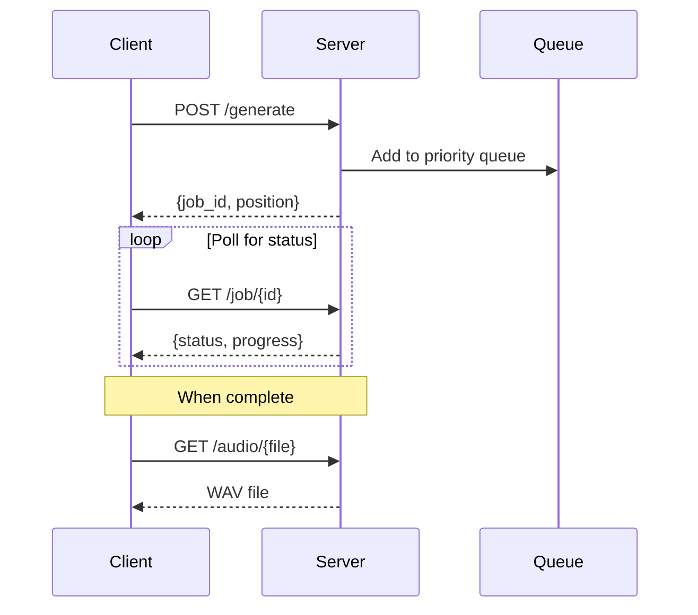

# Generation API

Submit audio generation jobs and monitor their progress.



## Submit Generation

### `POST /generate`

Submit a new audio generation job.

**Authentication**: Required

**Rate Limit**: Per-tier (3-60/hour based on subscription)

#### Request Body

| Field | Type | Required | Default | Description |
|-------|------|----------|---------|-------------|
| `prompt` | string | Yes | - | Text description of desired audio |
| `duration` | number | No | 8 | Duration in seconds (tier limits apply) |
| `model` | string | No | "music" | Model: "music", "audio", or "magnet" |
| `loopable` | boolean | No | false | Apply crossfade for seamless loops |

#### Duration Limits by Tier

| Tier | Max Duration |
|------|--------------|
| Creator | 180s |
| Premium | 120s |
| Supporter | 60s |
| Free | 30s |

#### Example Request

```bash
curl -X POST http://localhost:5309/generate \
  -H "Authorization: Bearer $TOKEN" \
  -H "Content-Type: application/json" \
  -d '{
    "prompt": "calm ambient music with soft piano and rain sounds",
    "duration": 30,
    "model": "music",
    "loopable": true
  }'
```

#### Success Response (201)

```json
{
  "job_id": "a1b2c3d4e5f6",
  "status": "queued",
  "position": 3,
  "priority": "supporter",
  "message": "Job queued at position 3"
}
```

#### Error Responses

| Status | Error | Cause |
|--------|-------|-------|
| 400 | "Prompt is required" | Missing prompt field |
| 400 | "Duration exceeds your tier limit" | Duration too long for tier |
| 401 | "Authentication required" | Missing or invalid token |
| 429 | "Rate limit exceeded" | Too many requests |
| 503 | "Queue is full" | Max 100 jobs in queue |

---

## Check Job Status

### `GET /job/{job_id}`

Get the current status of a generation job.

**Authentication**: Required (must be job owner)

#### Path Parameters

| Parameter | Type | Description |
|-----------|------|-------------|
| `job_id` | string | The job ID from /generate response |

#### Example Request

```bash
curl -H "Authorization: Bearer $TOKEN" \
  http://localhost:5309/job/a1b2c3d4e5f6
```

#### Response - Queued

```json
{
  "job_id": "a1b2c3d4e5f6",
  "status": "queued",
  "position": 2,
  "progress": "Waiting in queue...",
  "model": "music",
  "duration": 30,
  "priority": "supporter",
  "created": "2024-01-15T10:30:00Z"
}
```

#### Response - Processing

```json
{
  "job_id": "a1b2c3d4e5f6",
  "status": "processing",
  "progress": "Generating audio... 45%",
  "progress_pct": 45,
  "model": "music"
}
```

#### Response - Completed

```json
{
  "job_id": "a1b2c3d4e5f6",
  "status": "completed",
  "audio_url": "/audio/a1b2c3d4e5f6.wav",
  "spectrogram_url": "/spectrogram/a1b2c3d4e5f6.png",
  "duration": 30,
  "quality_score": 85,
  "generation_id": "a1b2c3d4e5f6",
  "completed": "2024-01-15T10:32:15Z"
}
```

#### Response - Failed

```json
{
  "job_id": "a1b2c3d4e5f6",
  "status": "failed",
  "error": "GPU memory exhausted",
  "retry_count": 2
}
```

---

## Queue Status

### `GET /queue-status`

Get current queue status (public, no auth required).

**Authentication**: None

#### Example Request

```bash
curl http://localhost:5309/queue-status
```

#### Response

```json
{
  "queue_length": 5,
  "current_job": "xyz789",
  "jobs": [
    {
      "id": "abc123",
      "status": "processing",
      "model": "music",
      "priority": "creator",
      "position": 1
    },
    {
      "id": "def456",
      "status": "queued",
      "model": "audio",
      "priority": "free",
      "position": 2
    }
  ]
}
```

---

## Detailed Queue

### `GET /api/queue`

Get detailed queue information for queue explorer UI.

**Authentication**: None

#### Response

```json
{
  "jobs": [
    {
      "id": "abc123",
      "status": "processing",
      "model": "music",
      "duration": 30,
      "priority": "creator",
      "created": "2024-01-15T10:30:00Z",
      "progress": "Generating audio... 67%",
      "progress_pct": 67,
      "position": 1
    }
  ],
  "current_job": "abc123",
  "total": 5
}
```

---

## Cancel Job

### `POST /api/queue/{job_id}/cancel`

Cancel a queued job. Cannot cancel jobs that are already processing.

**Authentication**: Required (must be job owner)

**Rate Limit**: 60/hour

#### Example Request

```bash
curl -X POST http://localhost:5309/api/queue/abc123/cancel \
  -H "Authorization: Bearer $TOKEN"
```

#### Success Response

```json
{
  "success": true,
  "message": "Job cancelled"
}
```

#### Error Responses

| Status | Error | Cause |
|--------|-------|-------|
| 400 | "Cannot cancel a job that is already processing" | Job started |
| 400 | "Job is not in queue" | Already completed/failed |
| 403 | "Not authorized to cancel this job" | Not job owner |
| 404 | "Job not found" | Invalid job ID |

---

## Skip Queue

### `POST /api/queue/{job_id}/skip`

Pay Aura to skip to front of queue.

**Authentication**: Required (must be job owner)

**Rate Limit**: 30/hour

#### Pricing

| Duration | Cost |
|----------|------|
| 1-10s | 1 Aura |
| 11-30s | 3 Aura |
| 31-60s | 5 Aura |
| 61-120s | 10 Aura |
| 121s+ | 15 Aura |

#### Example Request

```bash
curl -X POST http://localhost:5309/api/queue/abc123/skip \
  -H "Authorization: Bearer $TOKEN"
```

#### Success Response

```json
{
  "success": true,
  "message": "Skipped to front of queue for 3 Aura",
  "cost": 3,
  "new_balance": 47
}
```

#### Error Responses

| Status | Error | Cause |
|--------|-------|-------|
| 400 | "Insufficient Aura balance" | Not enough Aura |
| 400 | "Job already skipped" | Already used skip |
| 403 | "Not authorized" | Not job owner |

---

## Get Skip Pricing

### `GET /api/queue/skip-pricing`

Get current skip-the-queue pricing for UI display.

**Authentication**: None

#### Response

```json
{
  "pricing": [
    {"max_duration": 10, "cost": 1, "label": "Short SFX"},
    {"max_duration": 30, "cost": 3, "label": "Medium clip"},
    {"max_duration": 60, "cost": 5, "label": "Long SFX"},
    {"max_duration": 120, "cost": 10, "label": "Song"},
    {"max_duration": 999, "cost": 15, "label": "Long song"}
  ],
  "currency": "aura",
  "description": "Pay with Aura to skip the queue and get your audio faster"
}
```

---

## Audio Files

### `GET /audio/{filename}`

Download generated audio file.

**Authentication**: None

#### Response

- **Content-Type**: `audio/wav`
- **Body**: WAV audio data

### `GET /spectrogram/{filename}`

Get spectrogram visualization.

**Authentication**: None

#### Response

- **Content-Type**: `image/png`
- **Body**: PNG image data

---

## System Status

### `GET /status`

Get server status including model state and GPU info.

**Authentication**: None

#### Response

```json
{
  "models": {
    "music": "ready",
    "audio": "loading",
    "magnet": "unloaded",
    "tts": "ready"
  },
  "gpu": {
    "available": true,
    "name": "NVIDIA GeForce RTX 4090",
    "memory_used_gb": 4.2,
    "memory_total_gb": 24.0,
    "memory_percent": 17.5,
    "busy": true
  },
  "queue_length": 3,
  "queue_by_model": {
    "music": 2,
    "audio": 1
  },
  "estimated_wait": {
    "music": 45,
    "audio": 30
  }
}
```

---

## See Also

- [Library API](library.md) - Browse and search generated audio
- [TTS API](tts.md) - Text-to-speech generation
- [Queue System](../systems/queue-system.md) - Priority and scheduling details

---

[← Back to API Overview](README.md)
