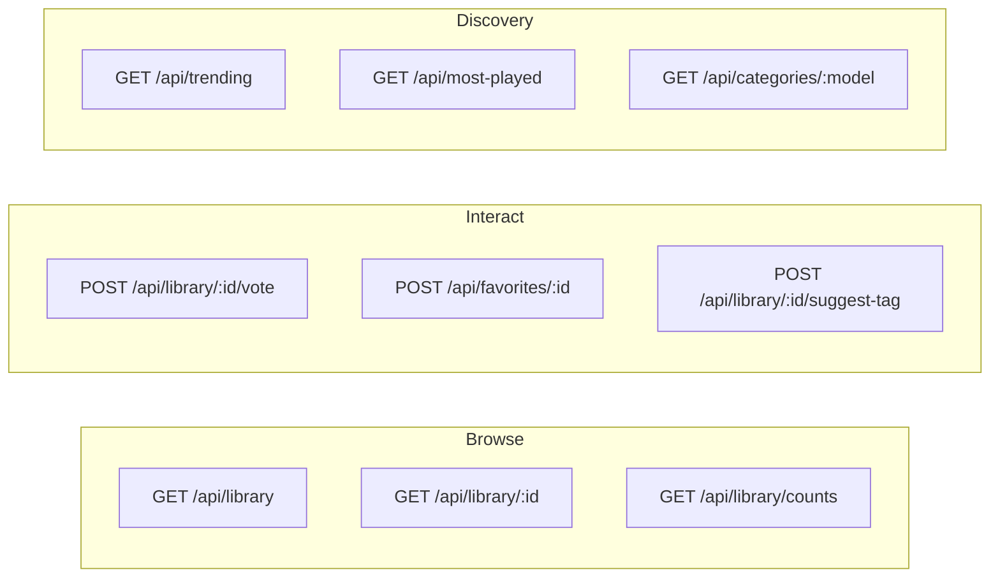

# Library API

Browse, search, vote, and manage favorites in the audio library.



## Browse Library

### `GET /api/library`

Get paginated library with filters and search.

**Authentication**: None

**Rate Limit**: 300/minute

#### Query Parameters

| Parameter | Type | Default | Description |
|-----------|------|---------|-------------|
| `page` | number | 1 | Page number |
| `per_page` | number | 20 | Items per page (max 100) |
| `model` | string | - | Filter: "music", "audio", or "voice" |
| `search` | string | - | Full-text search in prompts |
| `sort` | string | "created" | Sort: "created", "votes", "plays" |
| `category` | string | - | Filter by category/genre |
| `source` | string | - | Filter by source platform |

#### Example Request

```bash
# Search for ambient music
curl "http://localhost:5309/api/library?q=ambient&model=music&sort=votes"

# Browse SFX by category
curl "http://localhost:5309/api/library?model=audio&category=explosion"
```

#### Response

```json
{
  "items": [
    {
      "id": "abc123",
      "filename": "abc123.wav",
      "prompt": "calm ambient music with soft piano",
      "model": "music",
      "duration": 30,
      "category": ["ambient", "piano", "calm"],
      "upvotes": 15,
      "downvotes": 2,
      "plays": 142,
      "created_at": "2024-01-15T10:30:00Z",
      "audio_url": "/audio/abc123.wav",
      "spectrogram_url": "/spectrogram/abc123.png"
    }
  ],
  "page": 1,
  "per_page": 20,
  "total": 1250,
  "has_more": true
}
```

---

## Get Single Item

### `GET /api/library/{gen_id}`

Get details for a single generation.

**Authentication**: None

#### Response

```json
{
  "id": "abc123",
  "filename": "abc123.wav",
  "prompt": "calm ambient music with soft piano",
  "model": "music",
  "duration": 30,
  "category": ["ambient", "piano", "calm"],
  "upvotes": 15,
  "downvotes": 2,
  "plays": 142,
  "downloads": 28,
  "quality_score": 85,
  "created_at": "2024-01-15T10:30:00Z"
}
```

---

## Library Counts

### `GET /api/library/counts`

Get total counts by content type.

**Authentication**: None

#### Response

```json
{
  "music": 850,
  "audio": 320,
  "voice": 80,
  "total": 1250
}
```

---

## Category Counts

### `GET /api/library/category-counts`

Get counts for each category/genre.

**Authentication**: None

#### Query Parameters

| Parameter | Type | Description |
|-----------|------|-------------|
| `model` | string | Optional filter: "music" or "audio" |

#### Response

```json
{
  "ambient": 120,
  "electronic": 95,
  "piano": 78,
  "explosion": 45,
  "footstep": 32
}
```

---

## Voting

### `POST /api/library/{gen_id}/vote`

Cast or update a vote with optional private feedback.

**Authentication**: Required

**Rate Limit**: 100/hour

#### Request Body

| Field | Type | Required | Description |
|-------|------|----------|-------------|
| `vote` | number | Yes | 1 (upvote), -1 (downvote), or 0 (remove) |
| `feedback_reasons` | array | No | Feedback tags (see below) |
| `notes` | string | No | Private feedback text |
| `suggested_model` | string | No | Suggest different model type |

#### Feedback Reason Tags

**Positive** (for upvotes):
- `high_quality`, `creative`, `useful`, `matches_prompt`, `good_length`

**Negative** (for downvotes):
- `low_quality`, `noise`, `clipping`, `too_short`, `wrong_style`, `doesnt_match`, `offensive`

#### Example Request

```bash
curl -X POST http://localhost:5309/api/library/abc123/vote \
  -H "Authorization: Bearer $TOKEN" \
  -H "Content-Type: application/json" \
  -d '{
    "vote": 1,
    "feedback_reasons": ["high_quality", "matches_prompt"]
  }'
```

#### Response

```json
{
  "success": true,
  "upvotes": 16,
  "downvotes": 2,
  "user_vote": 1
}
```

---

## Get User Votes

### `POST /api/library/votes`

Get user's votes for multiple generations (for UI state).

**Authentication**: Required

**Rate Limit**: 200/hour

#### Request Body

```json
{
  "generation_ids": ["abc123", "def456", "ghi789"]
}
```

#### Response

```json
{
  "votes": {
    "abc123": 1,
    "def456": -1,
    "ghi789": 0
  }
}
```

---

## Feedback Summary

### `GET /api/library/{gen_id}/feedback`

Get aggregated feedback for a generation.

**Authentication**: None

#### Response

```json
{
  "positive": {
    "high_quality": 8,
    "matches_prompt": 5,
    "creative": 3
  },
  "negative": {
    "too_short": 2,
    "noise": 1
  },
  "total_votes": 17
}
```

---

## Favorites

### `POST /api/favorites/{gen_id}`

Add a generation to favorites.

**Authentication**: Required

**Rate Limit**: 100/hour

#### Response

```json
{
  "success": true,
  "favorited": true,
  "was_new": true
}
```

### `DELETE /api/favorites/{gen_id}`

Remove from favorites.

**Authentication**: Required

#### Response

```json
{
  "success": true,
  "favorited": false,
  "was_removed": true
}
```

### `GET /api/favorites`

Get user's favorited items.

**Authentication**: Required

#### Query Parameters

| Parameter | Type | Description |
|-----------|------|-------------|
| `page` | number | Page number |
| `per_page` | number | Items per page |
| `model` | string | Filter by model type |

#### Response

```json
{
  "items": [
    {
      "id": "abc123",
      "prompt": "ambient forest sounds",
      "model": "audio",
      "duration": 30,
      "favorited_at": "2024-01-15T10:30:00Z"
    }
  ],
  "page": 1,
  "total": 25
}
```

### `POST /api/favorites/check`

Check which items are favorited (batch).

**Authentication**: Required

#### Request Body

```json
{
  "generation_ids": ["abc123", "def456"]
}
```

#### Response

```json
{
  "favorites": {
    "abc123": true,
    "def456": false
  }
}
```

---

## Tag Suggestions

Crowdsourced categorization - when 3+ users agree, categories are auto-updated.

### `POST /api/library/{gen_id}/suggest-tag`

Suggest a category tag.

**Authentication**: Optional (IP-based for anonymous)

**Rate Limit**: 50/hour

#### Request Body

| Field | Type | Required | Description |
|-------|------|----------|-------------|
| `category` | string | Yes | Category to suggest |
| `action` | string | No | "add" (default) or "remove" |

#### Example Request

```bash
curl -X POST http://localhost:5309/api/library/abc123/suggest-tag \
  -H "Content-Type: application/json" \
  -d '{
    "category": "ambient",
    "action": "add"
  }'
```

#### Response

```json
{
  "success": true,
  "suggestion_count": 2,
  "consensus_reached": false,
  "message": "1 more vote needed for consensus"
}
```

### `POST /api/library/{gen_id}/cancel-tag`

Cancel your own tag suggestion.

#### Request Body

```json
{
  "category": "ambient",
  "action": "add"
}
```

### `GET /api/library/{gen_id}/tag-suggestions`

Get all suggestions with vote counts.

#### Response

```json
{
  "suggestions": [
    {
      "category": "ambient",
      "action": "add",
      "count": 2,
      "user_suggested": true
    },
    {
      "category": "electronic",
      "action": "remove",
      "count": 1,
      "user_suggested": false
    }
  ],
  "current_categories": ["electronic", "synth"]
}
```

---

## Discovery

### `GET /api/trending`

Get trending items (recent + popular).

**Authentication**: None

#### Query Parameters

| Parameter | Type | Description |
|-----------|------|-------------|
| `limit` | number | Max items (default 20) |
| `model` | string | Filter by model type |

#### Response

```json
{
  "items": [
    {
      "id": "abc123",
      "prompt": "epic orchestral trailer music",
      "score": 145,
      "plays": 89,
      "upvotes": 56
    }
  ]
}
```

### `GET /api/most-played`

Get most played items.

**Authentication**: None

#### Response

```json
{
  "items": [
    {
      "id": "abc123",
      "prompt": "lofi hip hop study beats",
      "plays": 1250,
      "model": "music"
    }
  ]
}
```

---

## Available Categories

### `GET /api/categories/{model}`

Get available categories for a model type.

**Authentication**: None

#### Path Parameters

| Parameter | Values |
|-----------|--------|
| `model` | "music" or "audio" |

#### Response (Music)

```json
{
  "categories": [
    "electronic", "ambient", "orchestral", "rock", "jazz",
    "lofi", "cinematic", "happy", "sad", "energetic"
  ]
}
```

#### Response (Audio/SFX)

```json
{
  "categories": [
    "explosion", "footstep", "whoosh", "notification",
    "nature", "ambient", "vehicle", "weapon"
  ]
}
```

---

## See Also

- [Generation API](generation.md) - Create new audio
- [Playlists API](playlists.md) - Organize favorites
- [Database](../systems/database.md) - Category system details

---

[← Back to API Overview](README.md)
