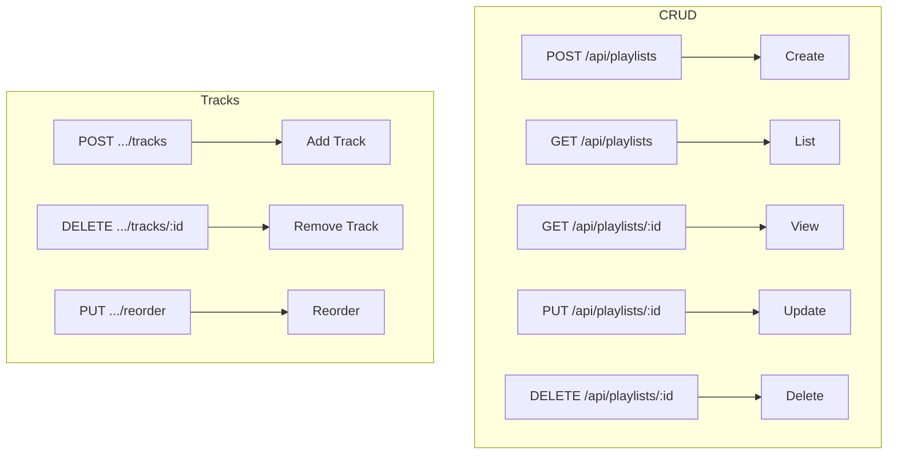
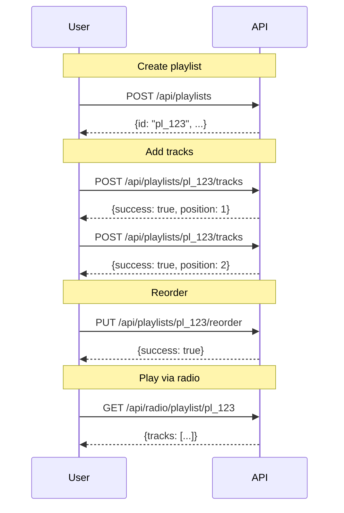

# Playlists API

Create and manage playlists of generated audio.



## Create Playlist

### `POST /api/playlists`

Create a new playlist.

**Authentication**: Required

**Rate Limit**: 20/hour

#### Request Body

| Field | Type | Required | Max Length | Description |
|-------|------|----------|------------|-------------|
| `name` | string | Yes | 100 | Playlist name |
| `description` | string | No | 500 | Optional description |

#### Example Request

```bash
curl -X POST http://localhost:5309/api/playlists \
  -H "Authorization: Bearer $TOKEN" \
  -H "Content-Type: application/json" \
  -d '{
    "name": "Chill Study Mix",
    "description": "Relaxing beats for focus"
  }'
```

#### Success Response (201)

```json
{
  "id": "pl_abc123xyz789",
  "name": "Chill Study Mix",
  "description": "Relaxing beats for focus",
  "user_id": "user_456",
  "created_at": "2024-01-15T10:30:00Z",
  "track_count": 0
}
```

#### Error Responses

| Status | Error | Cause |
|--------|-------|-------|
| 400 | "Playlist name is required" | Missing name |
| 400 | "Name too long" | Exceeds 100 chars |
| 401 | "Authentication required" | No token |
| 429 | "Rate limit exceeded" | Too many requests |

---

## List Playlists

### `GET /api/playlists`

Get user's playlists.

**Authentication**: Required

#### Query Parameters

| Parameter | Type | Default | Description |
|-----------|------|---------|-------------|
| `page` | number | 1 | Page number |
| `per_page` | number | 20 | Items per page (max 100) |

#### Response

```json
{
  "items": [
    {
      "id": "pl_abc123xyz789",
      "name": "Chill Study Mix",
      "description": "Relaxing beats for focus",
      "track_count": 12,
      "created_at": "2024-01-15T10:30:00Z",
      "updated_at": "2024-01-20T15:45:00Z"
    }
  ],
  "page": 1,
  "per_page": 20,
  "total": 5
}
```

---

## Get Playlist

### `GET /api/playlists/{playlist_id}`

Get a playlist with its tracks.

**Authentication**: Optional (for ownership check)

#### Response

```json
{
  "id": "pl_abc123xyz789",
  "name": "Chill Study Mix",
  "description": "Relaxing beats for focus",
  "user_id": "user_456",
  "created_at": "2024-01-15T10:30:00Z",
  "updated_at": "2024-01-20T15:45:00Z",
  "is_owner": true,
  "tracks": [
    {
      "position": 1,
      "generation_id": "gen_111",
      "prompt": "lofi hip hop study beats",
      "model": "music",
      "duration": 30,
      "audio_url": "/audio/gen_111.wav",
      "added_at": "2024-01-16T12:00:00Z"
    },
    {
      "position": 2,
      "generation_id": "gen_222",
      "prompt": "calm ambient piano music",
      "model": "music",
      "duration": 45,
      "audio_url": "/audio/gen_222.wav",
      "added_at": "2024-01-17T09:30:00Z"
    }
  ]
}
```

---

## Update Playlist

### `PUT /api/playlists/{playlist_id}`

Update playlist name or description.

**Authentication**: Required (must be owner)

**Rate Limit**: 50/hour

#### Request Body

| Field | Type | Description |
|-------|------|-------------|
| `name` | string | New name (optional) |
| `description` | string | New description (optional) |

#### Example Request

```bash
curl -X PUT http://localhost:5309/api/playlists/pl_abc123xyz789 \
  -H "Authorization: Bearer $TOKEN" \
  -H "Content-Type: application/json" \
  -d '{
    "name": "Ultimate Study Playlist",
    "description": "The best focus music collection"
  }'
```

#### Response

```json
{
  "id": "pl_abc123xyz789",
  "name": "Ultimate Study Playlist",
  "description": "The best focus music collection",
  "updated_at": "2024-01-21T10:00:00Z"
}
```

---

## Delete Playlist

### `DELETE /api/playlists/{playlist_id}`

Delete a playlist (tracks are not deleted, just unlinked).

**Authentication**: Required (must be owner)

**Rate Limit**: 20/hour

#### Response

```json
{
  "success": true
}
```

#### Error Responses

| Status | Error | Cause |
|--------|-------|-------|
| 404 | "Playlist not found or not authorized" | Wrong ID or not owner |

---

## Add Track

### `POST /api/playlists/{playlist_id}/tracks`

Add a generation to a playlist.

**Authentication**: Required (must be owner)

**Rate Limit**: 200/hour

#### Request Body

| Field | Type | Required | Description |
|-------|------|----------|-------------|
| `generation_id` | string | Yes | ID of generation to add |

#### Example Request

```bash
curl -X POST http://localhost:5309/api/playlists/pl_abc123xyz789/tracks \
  -H "Authorization: Bearer $TOKEN" \
  -H "Content-Type: application/json" \
  -d '{
    "generation_id": "gen_333"
  }'
```

#### Success Response

```json
{
  "success": true,
  "position": 3,
  "track_count": 3
}
```

#### Error Responses

| Status | Error | Cause |
|--------|-------|-------|
| 400 | "generation_id required" | Missing ID |
| 400 | "Track already in playlist" | Duplicate |
| 400 | "Generation not found" | Invalid generation ID |
| 404 | "Playlist not found or not authorized" | Wrong playlist |

---

## Remove Track

### `DELETE /api/playlists/{playlist_id}/tracks/{generation_id}`

Remove a track from a playlist.

**Authentication**: Required (must be owner)

**Rate Limit**: 200/hour

#### Response

```json
{
  "success": true
}
```

---

## Reorder Tracks

### `PUT /api/playlists/{playlist_id}/reorder`

Reorder tracks in a playlist.

**Authentication**: Required (must be owner)

**Rate Limit**: 50/hour

#### Request Body

| Field | Type | Description |
|-------|------|-------------|
| `track_order` | array | Generation IDs in desired order |

#### Example Request

```bash
curl -X PUT http://localhost:5309/api/playlists/pl_abc123xyz789/reorder \
  -H "Authorization: Bearer $TOKEN" \
  -H "Content-Type: application/json" \
  -d '{
    "track_order": ["gen_222", "gen_111", "gen_333"]
  }'
```

#### Response

```json
{
  "success": true,
  "track_count": 3
}
```

---

## Radio Playback

### `GET /api/radio/playlist/{playlist_id}`

Get playlist tracks for radio playback.

**Authentication**: None

#### Query Parameters

| Parameter | Type | Default | Description |
|-----------|------|---------|-------------|
| `shuffle` | boolean | false | Randomize order |

#### Response

```json
{
  "playlist": {
    "id": "pl_abc123xyz789",
    "name": "Chill Study Mix"
  },
  "tracks": [
    {
      "id": "gen_111",
      "prompt": "lofi hip hop study beats",
      "audio_url": "/audio/gen_111.wav",
      "duration": 30
    }
  ],
  "total": 12
}
```

---

## Workflow Example



---

## See Also

- [Library API](library.md) - Browse and favorite audio
- [Generation API](generation.md) - Create new audio
- [Radio Widget](../frontend/radio-widget.md) - Embed playlist player

---

[← Back to API Overview](README.md)
