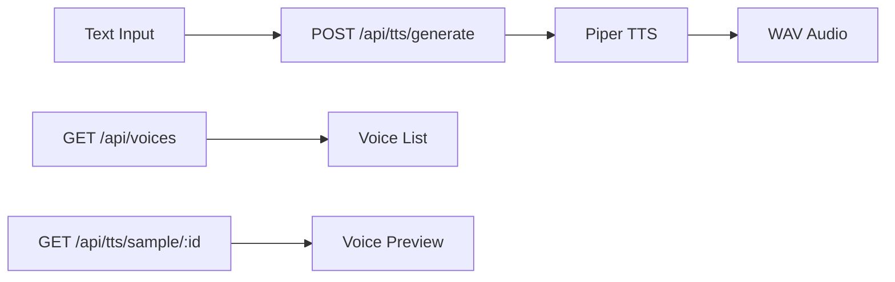
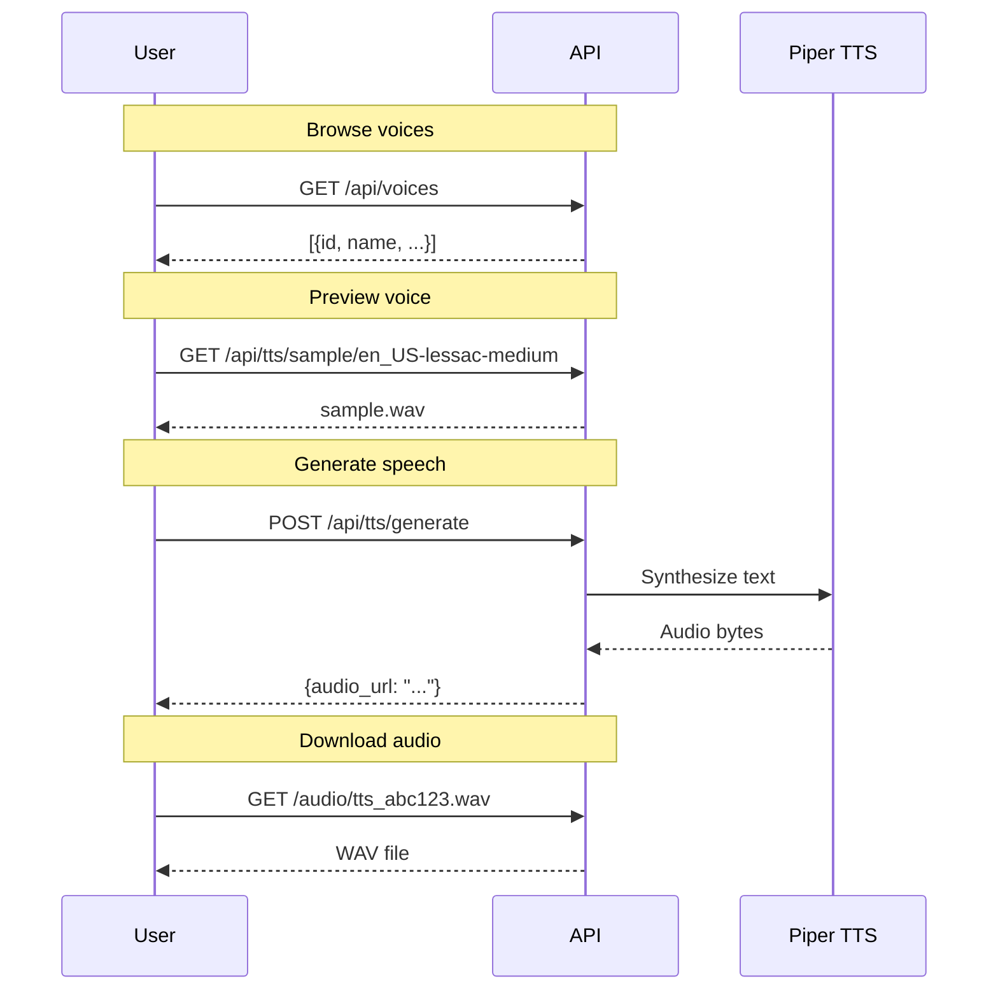

# Text-to-Speech API

Generate speech from text using Piper TTS voices.



## Overview

Sound Box includes text-to-speech using [Piper TTS](https://github.com/rhasspy/piper), supporting 20+ high-quality voices across multiple languages.

Key differences from music/SFX generation:
- **Instant** - No queue, processes immediately
- **CPU-based** - Works without GPU
- **Deterministic** - Same text produces same output

---

## List Voices

### `GET /api/voices`

Get all available TTS voices.

**Authentication**: None

#### Response

```json
{
  "voices": [
    {
      "id": "en_US-lessac-medium",
      "name": "Lessac",
      "language": "en_US",
      "quality": "medium",
      "sample_rate": 22050,
      "description": "American English female voice",
      "license": "Public Domain"
    },
    {
      "id": "en_GB-alan-low",
      "name": "Alan",
      "language": "en_GB",
      "quality": "low",
      "sample_rate": 16000,
      "description": "British English male voice",
      "license": "CC-BY-SA 4.0"
    }
  ],
  "total": 24
}
```

---

## Voice Licenses

### `GET /api/voice-licenses`

Get detailed license information for voice datasets.

**Authentication**: None

#### Response

```json
{
  "en_US-lessac-medium": {
    "dataset": "LJ Speech",
    "speaker": "Linda Johnson",
    "license": "Public Domain",
    "url": "https://keithito.com/LJ-Speech-Dataset/"
  },
  "en_GB-alan-low": {
    "dataset": "VCTK",
    "license": "CC-BY-SA 4.0",
    "url": "https://datashare.ed.ac.uk/handle/10283/3443"
  }
}
```

---

## Generate Speech

### `POST /api/tts/generate`

Generate speech from text.

**Authentication**: Required

**Rate Limit**: Per-tier (30-120/hour)

#### Request Body

| Field | Type | Required | Max | Description |
|-------|------|----------|-----|-------------|
| `text` | string | Yes | 5000 chars | Text to synthesize |
| `voice` | string | No | - | Voice ID (default: en_US-lessac-medium) |

#### Rate Limits by Tier

| Tier | TTS/Hour |
|------|----------|
| Creator | 120 |
| Premium | 60 |
| Supporter | 30 |
| Free | 10 |

#### Example Request

```bash
curl -X POST http://localhost:5309/api/tts/generate \
  -H "Authorization: Bearer $TOKEN" \
  -H "Content-Type: application/json" \
  -d '{
    "text": "Welcome to Sound Box! Generate amazing audio from text.",
    "voice": "en_US-lessac-medium"
  }'
```

#### Success Response

```json
{
  "success": true,
  "audio_url": "/audio/tts_abc123.wav",
  "duration": 3.2,
  "generation_id": "tts_abc123",
  "voice": "en_US-lessac-medium"
}
```

#### Error Responses

| Status | Error | Cause |
|--------|-------|-------|
| 400 | "Text is required" | Empty text |
| 400 | "Text too long" | Exceeds 5000 chars |
| 400 | "Voice not found" | Invalid voice ID |
| 401 | "Authentication required" | Missing token |
| 429 | "Rate limit exceeded" | Too many requests |
| 500 | "TTS generation failed" | Model error |

---

## Voice Sample

### `GET /api/tts/sample/{voice_id}`

Get a sample audio clip for a voice.

**Authentication**: None

#### Response

Audio file (WAV) with sample speech demonstrating the voice.

```bash
curl http://localhost:5309/api/tts/sample/en_US-lessac-medium \
  --output sample.wav
```

---

## Available Voices

### English (US)

| Voice ID | Name | Quality | Description |
|----------|------|---------|-------------|
| en_US-lessac-medium | Lessac | Medium | Clear female, general purpose |
| en_US-amy-medium | Amy | Medium | Warm female voice |
| en_US-ryan-medium | Ryan | Medium | Professional male |

### English (UK)

| Voice ID | Name | Quality | Description |
|----------|------|---------|-------------|
| en_GB-alan-low | Alan | Low | British male |
| en_GB-jenny-medium | Jenny | Medium | British female |

### Other Languages

| Voice ID | Language | Description |
|----------|----------|-------------|
| de_DE-thorsten-medium | German | Male voice |
| fr_FR-siwis-medium | French | Female voice |
| es_ES-davefx-medium | Spanish | Male voice |

---

## Best Practices

### Text Formatting

```python
# Good - natural punctuation
"Hello! Welcome to the show. Let's get started."

# Better - SSML-like emphasis with caps (limited support)
"This is REALLY important."

# Avoid - unnatural patterns
"hello welcome to the show lets get started"
```

### Handling Long Text

For text over ~1000 characters, consider:

1. **Split into paragraphs** - Generate separately, concatenate
2. **Use natural breaks** - Split at sentence boundaries
3. **Batch processing** - Submit multiple requests

```python
# Example: Split long text
paragraphs = long_text.split('\n\n')
for p in paragraphs:
    response = requests.post('/api/tts/generate',
                            json={'text': p, 'voice': 'en_US-lessac-medium'})
```

---

## Workflow Example



---

## Integration with Library

TTS generations are saved to the library with:
- `model`: "voice"
- `category`: Includes language and voice name
- `prompt`: The synthesized text

They can be:
- Searched via `/api/library?model=voice`
- Added to playlists
- Favorited and voted on

---

## See Also

- [Generation API](generation.md) - Music and SFX generation
- [Library API](library.md) - Browse TTS generations
- [Audio Generation](../systems/audio-generation.md) - Model details

---

[← Back to API Overview](README.md)
