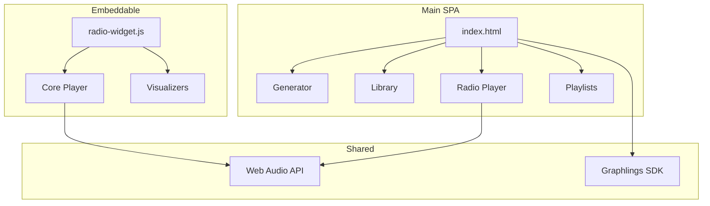

# Frontend Overview

Sound Box's web UI and embeddable components.



## Architecture

### Single-Page Application

The main UI is a single HTML file (`templates/index.html`) containing:
- **HTML** - Semantic structure
- **CSS** - Scoped styles with variables
- **JavaScript** - Vanilla JS, no framework

### Why Single-File?

| Benefit | Description |
|---------|-------------|
| No build step | Just edit and refresh |
| Fast deployment | Single file to update |
| Simple debugging | Everything in one place |
| Low dependencies | No npm, webpack, etc. |

---

## Main Components

### Generator

Audio generation interface:
- Prompt input with history
- Duration slider (tier-limited)
- Model selection (Music/SFX/Speech)
- Real-time job status
- Queue position display

### Library Browser

Browse and search generated audio:
- Infinite scroll pagination
- Full-text search
- Category filters
- Sort by votes, date, plays
- Vote and favorite buttons

### Radio Player

Continuous audio playback:
- Auto-advances through tracks
- Multiple visualizers
- Volume control
- Keyboard shortcuts
- Cross-tab sync

### Playlist Manager

Create and organize playlists:
- Drag-and-drop reordering
- Add from library
- Play as radio station

---

## Theming

CSS variables for consistent theming:

```css
:root {
    /* Colors */
    --bg-primary: #1a1a2e;
    --bg-secondary: #16213e;
    --text-primary: #e4e4e7;
    --text-muted: #a1a1aa;
    --accent: #6366f1;
    --accent-hover: #818cf8;

    /* Spacing */
    --spacing-xs: 0.25rem;
    --spacing-sm: 0.5rem;
    --spacing-md: 1rem;
    --spacing-lg: 1.5rem;

    /* Borders */
    --radius: 8px;
    --border-color: rgba(255, 255, 255, 0.1);
}
```

Components use these variables for consistency.

---

## Authentication

### Graphlings SDK Integration

```javascript
// Initialize Graphlings SDK
const graphlings = new GraphlingsSDK({
    appId: 'soundbox',
    onLogin: (user) => updateUI(user),
    onLogout: () => resetUI()
});

// Get auth token for API calls
async function apiCall(endpoint, options = {}) {
    const token = await graphlings.getToken();
    return fetch(endpoint, {
        ...options,
        headers: {
            'Authorization': `Bearer ${token}`,
            ...options.headers
        }
    });
}
```

### Tier-Based UI

UI adapts based on subscription tier:

```javascript
function updateUIForTier(tier) {
    // Show/hide premium features
    document.querySelectorAll('[data-tier]').forEach(el => {
        const requiredTier = el.dataset.tier;
        el.style.display = hasTierAccess(tier, requiredTier) ? '' : 'none';
    });

    // Update duration slider max
    const maxDuration = TIER_LIMITS[tier].max_duration;
    durationSlider.max = maxDuration;
}
```

---

## Keyboard Shortcuts

| Key | Action |
|-----|--------|
| `Space` | Play/Pause |
| `N` | Next track |
| `P` | Previous track |
| `M` | Mute/Unmute |
| `↑/↓` | Volume up/down |
| `1-5` | Switch visualizer |
| `F` | Toggle fullscreen |

---

## Toast Notifications

Feedback system for user actions:

```javascript
function showToast(message, type = 'info', duration = 3000) {
    const toast = document.createElement('div');
    toast.className = `toast toast-${type}`;
    toast.textContent = message;

    toastContainer.appendChild(toast);
    setTimeout(() => toast.remove(), duration);
}

// Usage
showToast('Generation complete!', 'success');
showToast('Network error', 'error');
showToast('No tracks found', 'warning');
```

---

## Modals

Reusable modal system:

```javascript
function showModal(content, options = {}) {
    const modal = document.createElement('div');
    modal.className = 'modal-overlay';
    modal.innerHTML = `
        <div class="modal-content">
            <button class="modal-close">&times;</button>
            ${content}
        </div>
    `;

    modal.querySelector('.modal-close').onclick = () => modal.remove();
    document.body.appendChild(modal);
}
```

---

## State Management

Simple global state with events:

```javascript
const AppState = {
    user: null,
    currentTrack: null,
    isPlaying: false,
    volume: 0.8,

    listeners: {},

    set(key, value) {
        this[key] = value;
        this.emit(key, value);
    },

    on(event, callback) {
        if (!this.listeners[event]) this.listeners[event] = [];
        this.listeners[event].push(callback);
    },

    emit(event, data) {
        (this.listeners[event] || []).forEach(cb => cb(data));
    }
};

// Usage
AppState.on('currentTrack', (track) => updateNowPlaying(track));
AppState.set('currentTrack', newTrack);
```

---

## File Structure

```
templates/
└── index.html           # Main SPA (4,000+ lines)

static/js/
├── radio-widget.js            # Widget factory
├── radio-widget-core.js       # Shared player logic
├── radio-widget-bridge.js     # API communication
├── radio-widget-events.js     # Event handling
├── radio-widget-visualizer.js # Visualizer manager
└── visualizations/
    ├── bars.js                # Bar visualizer
    ├── wave.js                # Waveform visualizer
    ├── circle.js              # Circular visualizer
    ├── particles.js           # Particle system
    ├── lissajous.js          # Lissajous curves
    ├── tempest.js            # Tempest-style
    ├── pong.js               # Pong game
    ├── breakout.js           # Breakout game
    └── snake.js              # Snake game
```

---

## Performance

### Lazy Loading

Heavy resources loaded on demand:
- Visualizers loaded when first used
- Images loaded as they scroll into view
- Audio buffers streamed, not preloaded

### Debouncing

Expensive operations are debounced:

```javascript
const debouncedSearch = debounce((query) => {
    searchLibrary(query);
}, 300);

searchInput.addEventListener('input', (e) => {
    debouncedSearch(e.target.value);
});
```

### Virtual Scrolling

Long lists use intersection observer:

```javascript
const observer = new IntersectionObserver((entries) => {
    if (entries[0].isIntersecting) {
        loadMoreItems();
    }
}, { threshold: 0.1 });

observer.observe(loadMoreTrigger);
```

---

## See Also

- [Radio Widget](radio-widget.md) - Embeddable player documentation
- [API Reference](../api/README.md) - Backend API
- [Architecture](../ARCHITECTURE.md) - System overview

---

[← Back to Documentation](../README.md)
