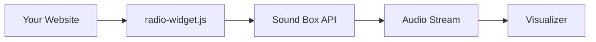

# Radio Widget

Embeddable audio player with visualizers for external websites.



## Quick Start

### 1. Include Scripts

```html
<!-- Required CSS -->
<link rel="stylesheet" href="https://soundbox.example.com/widget/graphlings-radio.css">

<!-- Required JS -->
<script src="https://soundbox.example.com/widget/graphlings-radio.js"></script>
```

### 2. Add Container

```html
<div id="radio-player"></div>
```

### 3. Initialize

```javascript
const radio = RadioWidget.create('#radio-player', {
    apiBaseUrl: 'https://soundbox.example.com',
    autoPlay: false
});
```

---

## Configuration

### Options

| Option | Type | Default | Description |
|--------|------|---------|-------------|
| `size` | string | "medium" | Size mode: "minimal", "small", "medium", "large" |
| `template` | string | "default" | Visual template |
| `apiBaseUrl` | string | "" | Sound Box server URL |
| `userId` | string | null | User ID for personalization |
| `autoPlay` | boolean | false | Auto-play on load |
| `connectToExisting` | boolean | true | Sync with other widgets |
| `audioElement` | HTMLAudioElement | null | Use existing audio element |

### Example with All Options

```javascript
const radio = RadioWidget.create('#player', {
    size: 'large',
    template: 'dark',
    apiBaseUrl: 'https://soundbox.example.com',
    userId: 'user_123',
    autoPlay: true,
    connectToExisting: true
});
```

---

## Size Modes

### Minimal

Compact play button only:

```javascript
RadioWidget.createMinimal('#mini-player');
```

```
┌─────────────────┐
│  ▶  Now Playing │
└─────────────────┘
```

### Small

Button with basic info:

```javascript
RadioWidget.create('#player', { size: 'small' });
```

```
┌─────────────────────────┐
│  ▶  Track Title         │
│     0:45 / 2:30         │
└─────────────────────────┘
```

### Medium (Default)

Full controls with visualizer:

```javascript
RadioWidget.create('#player', { size: 'medium' });
```

```
┌─────────────────────────────────┐
│  ┌───────────────────────────┐  │
│  │      VISUALIZER           │  │
│  └───────────────────────────┘  │
│                                 │
│  Track Title                    │
│  ▶ ━━━━━━━━━━━━━○━━━━━━━━ 1:30  │
│                                 │
│  ◀◀  ▶  ▶▶   🔊━━━━━━━━━━━━    │
└─────────────────────────────────┘
```

### Large

Full-featured with all visualizers:

```javascript
RadioWidget.create('#player', { size: 'large' });
```

---

## Visualizers

### Available Visualizers

| Name | Description |
|------|-------------|
| `bars` | Classic frequency bars |
| `wave` | Oscilloscope waveform |
| `circle` | Circular frequency display |
| `particles` | Reactive particle system |
| `lissajous` | Lissajous curves |
| `tempest` | Tempest arcade style |
| `pong` | Playable Pong game |
| `breakout` | Playable Breakout game |
| `snake` | Snake game with music |

### Changing Visualizers

```javascript
// Programmatically
radio.setVisualizer('particles');

// Or use keyboard shortcuts (1-9 keys)
```

### Custom Visualizer

```javascript
class MyVisualizer {
    constructor(canvas, audioAnalyser) {
        this.ctx = canvas.getContext('2d');
        this.analyser = audioAnalyser;
    }

    draw() {
        const data = new Uint8Array(this.analyser.frequencyBinCount);
        this.analyser.getByteFrequencyData(data);

        // Your visualization code
        this.ctx.fillStyle = '#6366f1';
        // ...
    }

    resize(width, height) {
        // Handle resize
    }

    destroy() {
        // Cleanup
    }
}

// Register
radio.registerVisualizer('custom', MyVisualizer);
```

---

## API Methods

### Playback Control

```javascript
// Play/Pause
radio.play();
radio.pause();
radio.togglePlay();

// Navigation
radio.next();
radio.previous();

// Volume (0-1)
radio.setVolume(0.5);
radio.mute();
radio.unmute();

// Seek (seconds)
radio.seek(30);
```

### Track Info

```javascript
// Get current track
const track = radio.getCurrentTrack();
// { id, prompt, duration, audio_url, ... }

// Get playback state
const state = radio.getState();
// { isPlaying, volume, currentTime, duration, ... }
```

### Sources

```javascript
// Load different content
radio.loadPlaylist('pl_abc123');
radio.loadCategory('ambient');
radio.loadRandom();
radio.loadFavorites();
```

### Events

```javascript
// Subscribe to events
radio.on('play', (track) => console.log('Playing:', track.prompt));
radio.on('pause', () => console.log('Paused'));
radio.on('trackChange', (track) => updateUI(track));
radio.on('timeUpdate', ({ currentTime, duration }) => updateProgress());
radio.on('error', (err) => console.error(err));

// Unsubscribe
const handler = () => {};
radio.on('play', handler);
radio.off('play', handler);
```

### Lifecycle

```javascript
// Destroy widget
radio.destroy();

// Destroy all widgets
RadioWidget.destroyAll();
```

---

## Events Reference

| Event | Data | Description |
|-------|------|-------------|
| `play` | track | Playback started |
| `pause` | - | Playback paused |
| `trackChange` | track | New track loaded |
| `timeUpdate` | {currentTime, duration} | Playback position |
| `volumeChange` | volume | Volume changed |
| `ended` | - | Track finished |
| `error` | error | Error occurred |
| `visualizerChange` | name | Visualizer changed |

---

## Cross-Tab Sync

Multiple widgets can share playback state:

```javascript
// Widget A starts playing
const widgetA = RadioWidget.create('#player-a');

// Widget B automatically syncs
const widgetB = RadioWidget.create('#player-b', {
    connectToExisting: true
});

// Both show same track
```

---

## Styling

### CSS Variables

Override in your stylesheet:

```css
.radio-widget {
    --widget-bg: #1a1a2e;
    --widget-text: #e4e4e7;
    --widget-accent: #6366f1;
    --widget-border: rgba(255, 255, 255, 0.1);
    --widget-radius: 12px;
}
```

### Custom Classes

Add custom classes to container:

```html
<div id="player" class="my-custom-player"></div>
```

```css
.my-custom-player .radio-widget-controls {
    background: linear-gradient(45deg, #1a1a2e, #2d2d44);
}
```

---

## Integration Examples

### React

```jsx
import { useEffect, useRef } from 'react';

function RadioPlayer() {
    const containerRef = useRef(null);
    const widgetRef = useRef(null);

    useEffect(() => {
        widgetRef.current = RadioWidget.create(containerRef.current, {
            apiBaseUrl: process.env.REACT_APP_SOUNDBOX_URL
        });

        return () => widgetRef.current?.destroy();
    }, []);

    return <div ref={containerRef} />;
}
```

### Vue

```vue
<template>
    <div ref="container"></div>
</template>

<script>
export default {
    mounted() {
        this.widget = RadioWidget.create(this.$refs.container, {
            apiBaseUrl: import.meta.env.VITE_SOUNDBOX_URL
        });
    },
    beforeUnmount() {
        this.widget?.destroy();
    }
};
</script>
```

### WordPress

```php
function enqueue_radio_widget() {
    wp_enqueue_style('radio-widget', 'https://soundbox.example.com/widget/graphlings-radio.css');
    wp_enqueue_script('radio-widget', 'https://soundbox.example.com/widget/graphlings-radio.js');
}
add_action('wp_enqueue_scripts', 'enqueue_radio_widget');
```

```html
[radio_widget id="player" size="medium"]
```

---

## Troubleshooting

### CORS Issues

Ensure Sound Box server allows your domain:

```python
# In app.py
CORS(app, origins=['https://your-website.com'])
```

### Audio Not Playing

Check browser autoplay policies:

```javascript
// User interaction required first
button.onclick = () => radio.play();
```

### Visualizer Not Working

Web Audio requires user gesture:

```javascript
// Initialize after user interaction
document.addEventListener('click', () => {
    radio.initAudioContext();
}, { once: true });
```

---

## See Also

- [Frontend Overview](README.md) - Main UI documentation
- [API Reference](../api/README.md) - Backend API
- [Library API](../api/library.md) - Browse audio sources

---

[← Back to Frontend](README.md)
