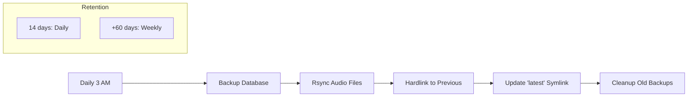
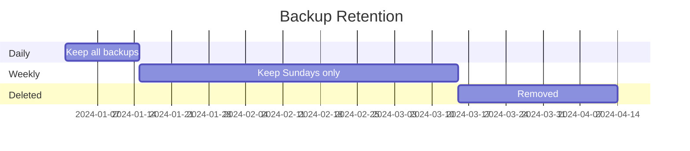

# Backup System

Automated backup with tiered retention for Sound Box.



## Overview

The backup system (`backup.py`) provides:

- **Database backup** - Safe SQLite backup while server runs
- **Audio sync** - rsync with hardlinks for space efficiency
- **Tiered retention** - Daily for 14 days, weekly for 2 months
- **Latest symlink** - Easy access to most recent backup

---

## Configuration

### Enable Backups

Set these in `.env`:

```bash
# Backup location (required to enable backups)
BACKUP_DIR=/var/backups/soundbox

# Backup time (24h format, default: 03:00)
BACKUP_TIME=03:00
```

### Directory Structure

After running, backup directory contains:

```
/var/backups/soundbox/
├── 2024-01-15/
│   ├── soundbox.db
│   └── generated/
│       ├── abc123.wav
│       └── ...
├── 2024-01-16/
│   ├── soundbox.db
│   └── generated/
│       └── ... (hardlinked where unchanged)
├── latest -> 2024-01-16/
└── ...
```

---

## Retention Policy



| Age | Policy |
|-----|--------|
| 0-14 days | Keep all daily backups |
| 14-74 days | Keep weekly backups (Sundays only) |
| >74 days | Delete |

---

## How It Works

### 1. Database Backup

Uses SQLite's backup API for consistency:

```python
conn = sqlite3.connect('soundbox.db')
backup_conn = sqlite3.connect('backup/soundbox.db')
conn.backup(backup_conn)
```

This is safe to run while the server is active.

### 2. Audio File Sync

Uses rsync with hardlinks to previous backup:

```bash
rsync -a --delete \
    --link-dest=/backups/previous/generated \
    ./generated/ \
    /backups/today/generated/
```

**Hardlinks mean:**
- Unchanged files share disk blocks with previous backup
- Only new/changed files use additional space
- Each backup is a complete, standalone copy

### 3. Latest Symlink

Always points to most recent successful backup:

```bash
ls -la /var/backups/soundbox/latest
# latest -> 2024-01-16/
```

### 4. Cleanup

After backup, old backups are pruned:

```python
def cleanup_old_backups():
    for backup_dir in backup_base.iterdir():
        backup_date = parse_date(backup_dir.name)

        if backup_date >= daily_cutoff:
            continue  # Keep recent

        if backup_date >= weekly_cutoff:
            if backup_date.weekday() == 6:  # Sunday
                continue  # Keep weekly
            else:
                remove(backup_dir)  # Delete weekday
        else:
            remove(backup_dir)  # Delete old
```

---

## Manual Operations

### Run Backup Manually

```bash
cd /opt/soundbox
source venv/bin/activate

# Run backup
python backup.py

# Or via API (if authenticated as admin)
curl -X POST http://localhost:5309/api/backup/run \
    -H "Authorization: Bearer $ADMIN_TOKEN"
```

### Check Backup Status

```bash
# Via CLI
python backup.py --status

# Via API
curl http://localhost:5309/api/backup/status
```

Response:

```json
{
  "enabled": true,
  "backup_dir": "/var/backups/soundbox",
  "retention_policy": "14 days daily, then weekly for 2 months",
  "backup_time": "03:00",
  "backup_count": 18,
  "latest_backup_date": "2024-01-16",
  "last_backup": {
    "time": "2024-01-16T03:00:15",
    "status": "success",
    "size_mb": 1250.5,
    "error": null
  }
}
```

---

## Restore Procedures

### Restore Database Only

```bash
# Stop server
sudo systemctl stop soundbox

# Restore database
cp /var/backups/soundbox/latest/soundbox.db /opt/soundbox/

# Start server
sudo systemctl start soundbox
```

### Full Restore

```bash
# Stop server
sudo systemctl stop soundbox

# Restore everything
rsync -a /var/backups/soundbox/latest/ /opt/soundbox/

# Start server
sudo systemctl start soundbox
```

### Point-in-Time Restore

```bash
# List available backups
ls -la /var/backups/soundbox/

# Restore specific date
rsync -a /var/backups/soundbox/2024-01-10/ /opt/soundbox/
```

---

## Space Management

### Check Backup Size

```bash
# Total backup directory size
du -sh /var/backups/soundbox/

# Per-backup size (actual disk usage with hardlinks)
du -sh /var/backups/soundbox/*/
```

### Estimate Space Savings

```bash
# Show how much space hardlinks save
du -sh /var/backups/soundbox/         # Apparent size
du -sh --apparent-size /var/backups/soundbox/  # Actual size
```

### Manual Cleanup

```bash
# Remove specific backup
rm -rf /var/backups/soundbox/2024-01-05/

# Run cleanup algorithm
python backup.py --cleanup
```

---

## Monitoring

### Check Last Backup

```bash
# Quick check
stat /var/backups/soundbox/latest

# Detailed status
python backup.py --status | jq '.last_backup'
```

### Verify Backup Integrity

```bash
# Check database integrity
sqlite3 /var/backups/soundbox/latest/soundbox.db "PRAGMA integrity_check;"

# Compare file counts
find /opt/soundbox/generated -type f | wc -l
find /var/backups/soundbox/latest/generated -type f | wc -l
```

---

## Troubleshooting

### Backup Not Running

1. Check if BACKUP_DIR is set:
   ```bash
   grep BACKUP_DIR /opt/soundbox/.env
   ```

2. Check service logs:
   ```bash
   journalctl -u soundbox | grep -i backup
   ```

3. Test manual backup:
   ```bash
   cd /opt/soundbox && source venv/bin/activate
   BACKUP_DIR=/var/backups/soundbox python backup.py
   ```

### rsync Errors

```bash
# Permission denied
sudo chown -R www-data:www-data /var/backups/soundbox

# Disk full
df -h /var/backups
# Consider: increasing disk, reducing retention, moving backup location
```

### Database Locked

If backup fails with "database is locked":
- Reduce concurrent write operations
- Consider using WAL mode:
  ```sql
  PRAGMA journal_mode=WAL;
  ```

---

## Offsite Backup

### Sync to Remote Server

```bash
# Add to crontab
30 4 * * * rsync -az /var/backups/soundbox/ backup-server:/soundbox-backups/
```

### Cloud Storage

```bash
# AWS S3
aws s3 sync /var/backups/soundbox/ s3://my-bucket/soundbox-backups/

# Google Cloud Storage
gsutil rsync -r /var/backups/soundbox/ gs://my-bucket/soundbox-backups/
```

---

## See Also

- [Deployment](deployment.md) - Production setup
- [Monitoring](monitoring.md) - Health checks
- [Database](../systems/database.md) - Schema details

---

[← Back to Documentation](../README.md)
