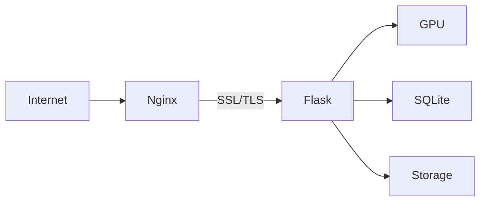

# Deployment Guide

Production deployment for Sound Box.



## Prerequisites

### Hardware

| Component | Minimum | Recommended |
|-----------|---------|-------------|
| CPU | 4 cores | 8+ cores |
| RAM | 8GB | 16GB+ |
| GPU | 8GB VRAM | 12GB+ VRAM |
| Storage | 50GB SSD | 500GB+ SSD |

### Software

- Ubuntu 22.04 LTS (recommended)
- Python 3.10+
- NVIDIA CUDA 12.1
- Nginx
- Let's Encrypt (certbot)

---

## Installation

### 1. System Setup

```bash
# Update system
sudo apt update && sudo apt upgrade -y

# Install dependencies
sudo apt install -y python3 python3-venv python3-pip \
    nginx certbot python3-certbot-nginx \
    ffmpeg git

# Install CUDA (if not present)
# See: https://developer.nvidia.com/cuda-downloads
```

### 2. Clone Repository

```bash
cd /opt
sudo git clone git@github.com:Valpatel/app-soundbox.git soundbox
sudo chown -R www-data:www-data /opt/soundbox
cd /opt/soundbox
```

### 3. Python Environment

```bash
python3 -m venv venv
source venv/bin/activate

# Install PyTorch with CUDA
pip install torch torchaudio --index-url https://download.pytorch.org/whl/cu121

# Install dependencies
pip install -r requirements.txt
```

### 4. Configuration

```bash
cp .env.example .env
nano .env
```

```bash
# Production settings
HOST=127.0.0.1          # Listen on localhost only (nginx proxies)
PORT=5309
FLASK_DEBUG=false

# Open Access Mode (default: true - no login required)
OPEN_ACCESS_MODE=true
IP_WHITELIST=            # Comma-separated IPs for creator-tier limits

# MCP server (AI agent integration)
MCP_PORT=5310

# Backup (recommended)
BACKUP_DIR=/var/backups/soundbox
BACKUP_TIME=03:00
```

### 5. Initialize Database

```bash
python -c "import database; database.init_db()"
```

---

## Service Management

Use the built-in service manager which sets up all three services:

```bash
./scripts/service.sh install    # Installs and starts everything
```

This creates:
1. **soundbox** - Main Flask server on :5309
2. **soundbox-mcp** - MCP server on :5310 (AI agent tools)
3. **Avahi mDNS** - LAN auto-discovery broadcast

```bash
./scripts/service.sh status     # Check all services
./scripts/service.sh restart    # Restart all services
./scripts/service.sh logs       # Follow logs (all services)
./scripts/service.sh uninstall  # Remove everything
```

### Manual Systemd (Alternative)

If you prefer manual configuration, create `/etc/systemd/system/soundbox.service`:

```ini
[Unit]
Description=Sound Box Audio Generation Server
After=network.target

[Service]
Type=simple
User=www-data
Group=www-data
WorkingDirectory=/opt/soundbox
Environment=PATH=/opt/soundbox/venv/bin
EnvironmentFile=/opt/soundbox/.env
ExecStart=/opt/soundbox/venv/bin/python app.py
Restart=always
RestartSec=10

# GPU access
SupplementaryGroups=video render

[Install]
WantedBy=multi-user.target
```

```bash
sudo systemctl daemon-reload
sudo systemctl enable soundbox
sudo systemctl start soundbox
```

---

## Nginx Configuration

Create `/etc/nginx/sites-available/soundbox`:

```nginx
server {
    listen 80;
    server_name soundbox.example.com;
    return 301 https://$server_name$request_uri;
}

server {
    listen 443 ssl http2;
    server_name soundbox.example.com;

    # SSL configuration (managed by certbot)
    ssl_certificate /etc/letsencrypt/live/soundbox.example.com/fullchain.pem;
    ssl_certificate_key /etc/letsencrypt/live/soundbox.example.com/privkey.pem;
    include /etc/letsencrypt/options-ssl-nginx.conf;
    ssl_dhparam /etc/letsencrypt/ssl-dhparams.pem;

    # Security headers
    add_header X-Frame-Options "SAMEORIGIN" always;
    add_header X-Content-Type-Options "nosniff" always;
    add_header X-XSS-Protection "1; mode=block" always;
    add_header Referrer-Policy "strict-origin-when-cross-origin" always;

    # Proxy to Flask
    location / {
        proxy_pass http://127.0.0.1:5309;
        proxy_set_header Host $host;
        proxy_set_header X-Real-IP $remote_addr;
        proxy_set_header X-Forwarded-For $proxy_add_x_forwarded_for;
        proxy_set_header X-Forwarded-Proto $scheme;

        # WebSocket support (if needed)
        proxy_http_version 1.1;
        proxy_set_header Upgrade $http_upgrade;
        proxy_set_header Connection "upgrade";
    }

    # Static files (optional optimization)
    location /audio/ {
        alias /opt/soundbox/generated/;
        expires 7d;
        add_header Cache-Control "public, immutable";
    }

    location /spectrogram/ {
        alias /opt/soundbox/spectrograms/;
        expires 7d;
        add_header Cache-Control "public, immutable";
    }

    # Rate limiting
    limit_req_zone $binary_remote_addr zone=api:10m rate=10r/s;
    location /generate {
        limit_req zone=api burst=5 nodelay;
        proxy_pass http://127.0.0.1:5309;
    }

    # Client body size (for large requests)
    client_max_body_size 10M;
}
```

Enable and test:

```bash
sudo ln -s /etc/nginx/sites-available/soundbox /etc/nginx/sites-enabled/
sudo nginx -t
sudo systemctl reload nginx
```

---

## SSL Certificate

```bash
sudo certbot --nginx -d soundbox.example.com
```

Auto-renewal is configured by default.

---

## Firewall

```bash
# Allow HTTP and HTTPS
sudo ufw allow 80/tcp
sudo ufw allow 443/tcp

# Allow MCP server (for AI agents on LAN)
sudo ufw allow 5310/tcp

# Allow mDNS (for LAN discovery)
sudo ufw allow 5353/udp

# Enable firewall
sudo ufw enable
```

---

## Directory Permissions

```bash
# Ensure www-data can write
sudo chown -R www-data:www-data /opt/soundbox/generated
sudo chown -R www-data:www-data /opt/soundbox/spectrograms
sudo chown -R www-data:www-data /opt/soundbox/soundbox.db

# Backup directory
sudo mkdir -p /var/backups/soundbox
sudo chown www-data:www-data /var/backups/soundbox
```

---

## Production Checklist

### Security

- [ ] `FLASK_DEBUG=false` in .env
- [ ] SSL certificate installed
- [ ] Firewall configured
- [ ] Rate limiting enabled in nginx
- [ ] Security headers configured

### Performance

- [ ] Static files served directly by nginx
- [ ] Audio files have cache headers
- [ ] GPU drivers up to date
- [ ] Sufficient disk space for generated files

### Reliability

- [ ] Systemd service enabled
- [ ] Auto-restart configured
- [ ] Backup system enabled
- [ ] Log rotation configured

### Monitoring

- [ ] Health endpoint accessible
- [ ] Log files checked regularly
- [ ] Disk space monitored
- [ ] GPU temperature monitored

---

## Log Management

### View Logs

```bash
# Application logs
sudo journalctl -u soundbox -f

# Nginx access logs
sudo tail -f /var/log/nginx/access.log

# Nginx error logs
sudo tail -f /var/log/nginx/error.log
```

### Log Rotation

Create `/etc/logrotate.d/soundbox`:

```
/var/log/soundbox/*.log {
    daily
    missingok
    rotate 14
    compress
    delaycompress
    notifempty
    create 0640 www-data www-data
}
```

---

## Scaling Considerations

### Single Server

Sound Box is designed for single-server deployment:
- GPU generation is single-threaded
- SQLite handles moderate load well
- Nginx handles concurrent connections

### High Availability

For critical deployments:
- Set up hot standby server
- Use shared storage for audio files
- Consider PostgreSQL for database

### Load Balancing

Not recommended - GPU-bound workload doesn't benefit from horizontal scaling.

---

## Updates

### Update Procedure

```bash
cd /opt/soundbox

# Backup first
./backup.py

# Pull changes
sudo -u www-data git pull

# Update dependencies
source venv/bin/activate
pip install -r requirements.txt

# Restart service
sudo systemctl restart soundbox

# Verify
curl http://localhost:5309/status
```

### Rollback

```bash
# Revert to previous commit
git checkout HEAD~1

# Restore database if needed
cp /var/backups/soundbox/latest/soundbox.db .

# Restart
sudo systemctl restart soundbox
```

---

## See Also

- [Backup](backup.md) - Backup procedures
- [Monitoring](monitoring.md) - Health checks
- [Getting Started](../GETTING-STARTED.md) - Installation guide

---

[← Back to Documentation](../README.md)
