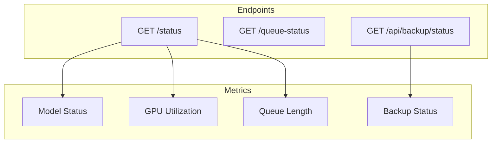

# Monitoring Guide

Health checks, metrics, and alerting for Sound Box.



## Health Endpoints

### System Status

`GET /status`

Primary health check endpoint:

```bash
curl http://localhost:5309/status | jq
```

Response:

```json
{
  "models": {
    "music": "ready",
    "audio": "ready",
    "magnet": "unloaded",
    "tts": "ready"
  },
  "gpu": {
    "available": true,
    "name": "NVIDIA GeForce RTX 4090",
    "memory_used_gb": 4.2,
    "memory_total_gb": 24.0,
    "memory_percent": 17.5,
    "busy": false
  },
  "queue_length": 0,
  "queue_by_model": {
    "music": 0,
    "audio": 0
  },
  "estimated_wait": {
    "music": 0,
    "audio": 0
  }
}
```

### Queue Status

`GET /queue-status`

Current job queue:

```json
{
  "queue_length": 3,
  "current_job": "abc123",
  "jobs": [
    {"id": "abc123", "status": "processing", "model": "music"}
  ]
}
```

### Backup Status

`GET /api/backup/status`

Backup system health:

```json
{
  "enabled": true,
  "backup_count": 18,
  "latest_backup_date": "2024-01-16",
  "last_backup": {
    "status": "success",
    "time": "2024-01-16T03:00:15"
  }
}
```

---

## Key Metrics

### Model Status

| Status | Meaning | Action |
|--------|---------|--------|
| `ready` | Loaded and available | None |
| `loading` | Currently loading | Wait |
| `unloaded` | Not in memory | Will load on demand |
| `error` | Failed to load | Check logs |

### GPU Metrics

| Metric | Warning | Critical |
|--------|---------|----------|
| Memory % | >80% | >95% |
| Temperature | >75°C | >85°C |
| Utilization | - | Stuck at 100% |

### Queue Metrics

| Metric | Warning | Critical |
|--------|---------|----------|
| Queue length | >50 | >90 |
| Oldest job age | >5 min | >15 min |
| Failed jobs/hour | >5 | >20 |

---

## Monitoring Scripts

### Basic Health Check

```bash
#!/bin/bash
# health-check.sh

STATUS=$(curl -s http://localhost:5309/status)

# Check if server responds
if [ -z "$STATUS" ]; then
    echo "CRITICAL: Server not responding"
    exit 2
fi

# Check GPU
GPU_AVAILABLE=$(echo $STATUS | jq -r '.gpu.available')
if [ "$GPU_AVAILABLE" != "true" ]; then
    echo "WARNING: GPU not available"
    exit 1
fi

# Check queue length
QUEUE_LEN=$(echo $STATUS | jq -r '.queue_length')
if [ "$QUEUE_LEN" -gt 90 ]; then
    echo "CRITICAL: Queue near capacity ($QUEUE_LEN/100)"
    exit 2
elif [ "$QUEUE_LEN" -gt 50 ]; then
    echo "WARNING: Queue growing ($QUEUE_LEN/100)"
    exit 1
fi

echo "OK: Server healthy, queue: $QUEUE_LEN"
exit 0
```

### GPU Temperature Monitor

```bash
#!/bin/bash
# gpu-temp.sh

TEMP=$(nvidia-smi --query-gpu=temperature.gpu --format=csv,noheader,nounits)

if [ "$TEMP" -gt 85 ]; then
    echo "CRITICAL: GPU temperature $TEMP°C"
    exit 2
elif [ "$TEMP" -gt 75 ]; then
    echo "WARNING: GPU temperature $TEMP°C"
    exit 1
fi

echo "OK: GPU temperature $TEMP°C"
exit 0
```

### Disk Space Monitor

```bash
#!/bin/bash
# disk-check.sh

# Check generated directory
USAGE=$(df /opt/soundbox/generated --output=pcent | tail -1 | tr -d ' %')

if [ "$USAGE" -gt 90 ]; then
    echo "CRITICAL: Disk usage $USAGE%"
    exit 2
elif [ "$USAGE" -gt 80 ]; then
    echo "WARNING: Disk usage $USAGE%"
    exit 1
fi

echo "OK: Disk usage $USAGE%"
exit 0
```

---

## Logging

### Application Logs

```bash
# Follow logs
sudo journalctl -u soundbox -f

# Last hour
sudo journalctl -u soundbox --since "1 hour ago"

# Errors only
sudo journalctl -u soundbox -p err
```

### Log Patterns

**Normal operation:**
```
Starting server... Models loading in background.
[GPU] 12.5GB free VRAM - preloading AudioGen
Backup scheduler started - daily at 03:00
```

**Warning signs:**
```
[Queue] Job abc123 waiting 120s - starvation risk
[GPU] Memory pressure: 95% used, unloading idle models
[Backup] Previous backup failed, retrying
```

**Critical issues:**
```
CUDA out of memory
[Queue] Worker thread crashed, restarting
Database locked, retrying
```

---

## Alerting

### Email Alerts (cron)

```bash
# Add to crontab
*/5 * * * * /opt/soundbox/scripts/health-check.sh || mail -s "SoundBox Alert" admin@example.com
```

### Slack Webhook

```bash
#!/bin/bash
# alert-slack.sh

WEBHOOK_URL="https://hooks.slack.com/services/XXX/YYY/ZZZ"

send_alert() {
    curl -X POST $WEBHOOK_URL \
        -H 'Content-type: application/json' \
        -d "{\"text\": \"$1\"}"
}

# Check health
RESULT=$(/opt/soundbox/scripts/health-check.sh 2>&1)
EXIT_CODE=$?

if [ $EXIT_CODE -ne 0 ]; then
    send_alert "SoundBox Alert: $RESULT"
fi
```

### Prometheus Metrics

Export metrics for Prometheus:

```python
# metrics.py (add to app.py)
from prometheus_client import Counter, Gauge, generate_latest

generations_total = Counter('soundbox_generations_total', 'Total generations', ['model'])
queue_size = Gauge('soundbox_queue_size', 'Current queue size')
gpu_memory = Gauge('soundbox_gpu_memory_percent', 'GPU memory usage')

@app.route('/metrics')
def metrics():
    queue_size.set(len([j for j in jobs.values() if j['status'] == 'queued']))
    gpu_memory.set(get_gpu_memory_percent())
    return generate_latest()
```

---

## Dashboard

### Grafana Dashboard

Key panels:
- **Queue Length** - Gauge with thresholds
- **GPU Memory** - Time series
- **Generations/Hour** - Rate graph
- **Model Uptime** - Status indicator
- **Error Rate** - Counter

### Simple HTML Dashboard

```html
<!DOCTYPE html>
<html>
<head><title>SoundBox Status</title></head>
<body>
<script>
async function updateStatus() {
    const status = await fetch('/status').then(r => r.json());
    document.getElementById('queue').textContent = status.queue_length;
    document.getElementById('gpu').textContent = status.gpu.memory_percent + '%';
}
setInterval(updateStatus, 5000);
updateStatus();
</script>
<h1>SoundBox Status</h1>
<p>Queue: <span id="queue">-</span></p>
<p>GPU: <span id="gpu">-</span></p>
</body>
</html>
```

---

## Capacity Planning

### Generation Throughput

| Model | Time/10s | Gens/Hour |
|-------|----------|-----------|
| MusicGen | ~15s | ~40 |
| AudioGen | ~12s | ~50 |
| MAGNeT | ~8s | ~75 |
| TTS | <1s | ~600+ |

### Storage Growth

Estimate: 1MB per 10 seconds of audio

| Daily Gens | Daily Growth | Monthly |
|------------|--------------|---------|
| 100 | ~300MB | ~9GB |
| 500 | ~1.5GB | ~45GB |
| 1000 | ~3GB | ~90GB |

### When to Scale

Consider scaling when:
- Queue consistently >50 jobs
- Average wait time >5 minutes
- GPU memory consistently >90%
- Disk filling faster than cleanup

---

## Troubleshooting

### High Queue Length

1. Check if worker is processing:
   ```bash
   curl http://localhost:5309/queue-status | jq '.current_job'
   ```

2. Check for stuck job:
   ```bash
   journalctl -u soundbox | grep -i "processing" | tail -5
   ```

3. Restart if needed:
   ```bash
   sudo systemctl restart soundbox
   ```

### GPU Out of Memory

1. Check what's using GPU:
   ```bash
   nvidia-smi
   ```

2. Kill competing processes:
   ```bash
   # If Ollama is running
   sudo systemctl stop ollama
   ```

3. Restart SoundBox:
   ```bash
   sudo systemctl restart soundbox
   ```

### Slow Response

1. Check system load:
   ```bash
   htop
   ```

2. Check disk I/O:
   ```bash
   iotop
   ```

3. Check network:
   ```bash
   ss -tlnp | grep 5309
   ```

---

## See Also

- [Deployment](deployment.md) - Production setup
- [Backup](backup.md) - Backup procedures
- [Architecture](../ARCHITECTURE.md) - System overview

---

[← Back to Documentation](../README.md)
