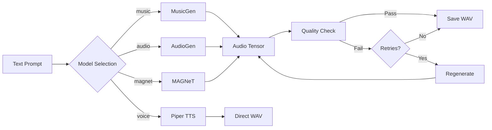
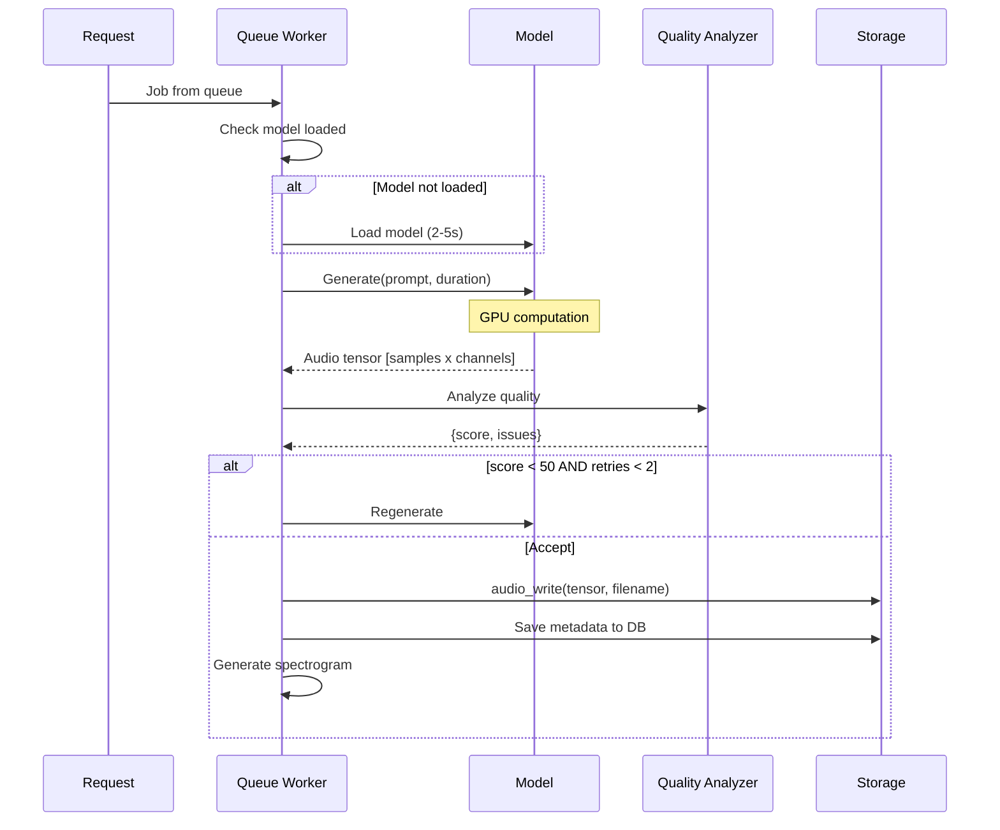
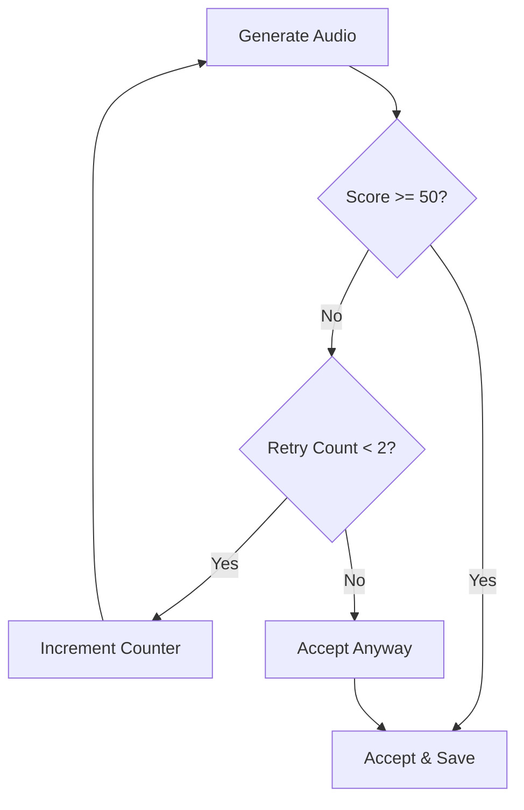
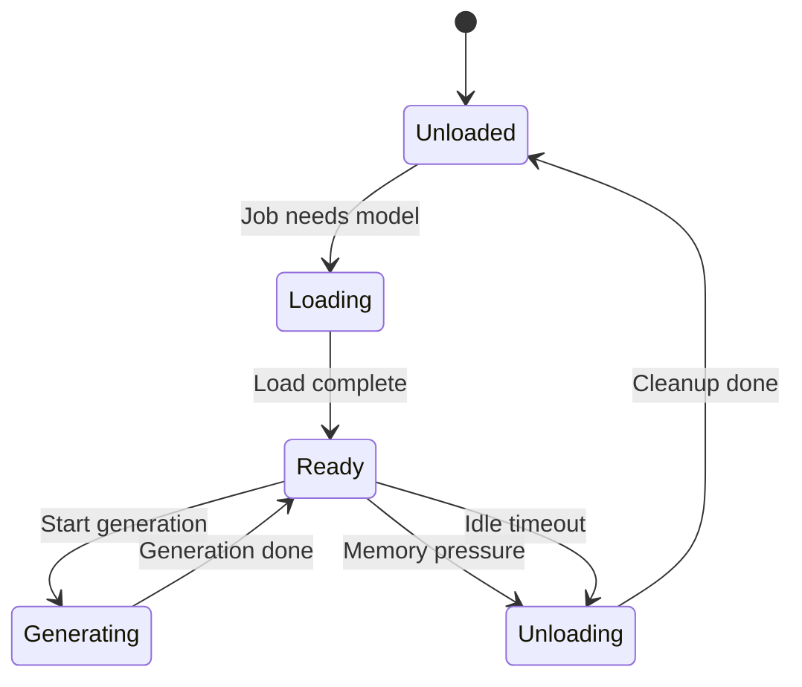

# Audio Generation System

Deep dive into AI models, generation pipeline, and quality analysis.



## AI Models

Sound Box uses Meta's [AudioCraft](https://github.com/facebookresearch/audiocraft) for music/SFX and [Piper](https://github.com/rhasspy/piper) for speech synthesis.

### MusicGen

Generates music from text descriptions.

| Attribute | Value |
|-----------|-------|
| VRAM | ~4GB |
| Sample Rate | 32kHz |
| Max Duration | 30s (can extend) |
| Best For | Melodies, background music, loops |

**Strengths**:
- Coherent melodic structure
- Good genre adherence
- Supports tempo/mood descriptors

**Limitations**:
- Limited instrument isolation
- Can struggle with complex arrangements

**Example Prompts**:
```
"upbeat electronic dance music with synth leads, 128 BPM"
"calm acoustic guitar fingerpicking, folk style"
"epic orchestral trailer music with brass and strings"
```

### AudioGen

Generates sound effects and ambient audio.

| Attribute | Value |
|-----------|-------|
| VRAM | ~5GB |
| Sample Rate | 16kHz |
| Max Duration | 30s |
| Best For | SFX, ambience, foley |

**Strengths**:
- Realistic sound effects
- Good environmental sounds
- Handles layered soundscapes

**Limitations**:
- Lower sample rate than MusicGen
- Less musical coherence (by design)

**Example Prompts**:
```
"forest ambience with birds chirping and wind through trees"
"explosion with debris and echoing aftermath"
"footsteps on wooden floor, slow walking pace"
```

### MAGNeT

Experimental non-autoregressive generator.

| Attribute | Value |
|-----------|-------|
| VRAM | ~6GB |
| Sample Rate | 32kHz |
| Max Duration | 30s |
| Best For | Experimental, alternative results |

**Strengths**:
- Faster generation (non-autoregressive)
- Different "creative signature"
- Good for variety

**Limitations**:
- Less predictable output
- May require more retries

### Piper TTS

Neural text-to-speech synthesis.

| Attribute | Value |
|-----------|-------|
| VRAM | ~0.5GB (CPU works) |
| Sample Rate | 16-22kHz (voice dependent) |
| Max Text | 5000 characters |
| Best For | Narration, voiceovers |

**Strengths**:
- Fast, instant generation
- No queue needed
- 20+ voice options
- Deterministic output

---

## Generation Pipeline



### Step-by-Step

1. **Job Pickup** - Worker gets next job from priority queue
2. **Model Check** - Load model if not already in memory
3. **Generation** - Call model with prompt and duration
4. **Quality Analysis** - Check for clipping, silence, noise
5. **Retry Logic** - Regenerate if quality is poor (max 2 retries)
6. **Save Audio** - Write WAV file to `generated/` directory
7. **Database** - Insert metadata and categories
8. **Spectrogram** - Generate visualization image

---

## Quality Analysis

Generated audio is analyzed to detect common issues.

### Quality Checks

```python
def analyze_audio_quality(audio_path):
    """Returns score 0-100 and list of issues."""

    # 1. Clipping Detection
    # Bad if >5% of samples near ±1.0
    clipping_ratio = np.mean(np.abs(y) > 0.98)

    # 2. Silence Detection
    # Bad if RMS energy is very low
    mean_rms = np.mean(librosa.feature.rms(y=y))

    # 3. High-Frequency Noise
    # Bad if >50% energy above 14kHz
    high_freq_energy = measure_hf_ratio(y, sr)

    # 4. Spectral Flatness
    # Bad if audio is pure noise (flatness > 0.7)
    flatness = np.mean(librosa.feature.spectral_flatness(y=y))

    return {
        'score': combined_score,
        'issues': detected_issues,
        'is_good': score >= 50 or len(issues) == 0
    }
```

### Issue Thresholds

| Check | Threshold | Impact |
|-------|-----------|--------|
| Clipping | >5% samples | Severe |
| Silence | RMS < 0.005 | Moderate |
| HF Noise | >50% @ 14kHz | Moderate |
| Flatness | >0.7 | Moderate |

### Retry Behavior



**Conservative approach**: Thresholds are set to avoid false positives. Only truly problematic audio triggers retries.

---

## Model Memory Management

### On-Demand Loading

Models are loaded only when needed:



### Preloading Strategy

On startup, Sound Box checks available GPU memory:

```python
def load_models():
    """Smart preloading based on GPU memory."""

    free_memory = get_free_gpu_memory()

    if free_memory >= 5.0:  # GB
        # Preload AudioGen (most common for SFX)
        preload("audio")
    else:
        # Mark all as available, load on demand
        mark_available(["music", "audio", "magnet"])
```

### Memory-Aware Checks

Before loading, checks system-wide GPU usage:

```bash
# Uses nvidia-smi to detect all GPU consumers
nvidia-smi --query-gpu=memory.free --format=csv,noheader,nounits
```

This allows coexistence with other GPU applications (e.g., Ollama for LLM inference).

---

## Loopable Audio

Optional crossfade for seamless loops.

```python
def make_loopable(wav, sample_rate, fade_duration=0.5):
    """Apply crossfade for seamless looping."""

    fade_samples = int(fade_duration * sample_rate)

    # Fade out ending
    result[..., -fade_samples:] *= fade_out_curve

    # Crossfade start/end
    end_section = wav[..., -fade_samples:] * fade_in_curve
    result[..., :fade_samples] = (
        result[..., :fade_samples] * fade_in_curve +
        end_section * fade_out_curve
    )

    return result
```

Enabled via `loopable: true` in generation request.

---

## Spectrogram Visualization

Mel spectrograms are generated for each audio file.

```python
def generate_spectrogram(audio_path, output_path):
    """Generate mel spectrogram image."""

    # Load audio
    y, sr = librosa.load(audio_path, sr=None)

    # Compute mel spectrogram
    S = librosa.feature.melspectrogram(
        y=y, sr=sr,
        n_mels=128,
        fmax=8000
    )
    S_dB = librosa.power_to_db(S, ref=np.max)

    # Plot with dark theme
    plt.style.use('dark_background')
    librosa.display.specshow(S_dB, x_axis='time', y_axis='mel',
                             sr=sr, fmax=8000, cmap='magma')

    plt.savefig(output_path)
```

Spectrograms are:
- Stored in `spectrograms/` directory
- Generated once, served statically
- Dark theme to match UI

---

## Prompt Tips

### Music Generation

**Good prompts include**:
- Genre/style (electronic, jazz, orchestral)
- Mood/energy (calm, upbeat, intense)
- Instruments (piano, strings, synth)
- Tempo indication (slow, 120 BPM, driving)

```
"melancholic piano solo with soft reverb, slow tempo"
"energetic 80s synthwave with pulsing bassline and arpeggios"
"gentle acoustic folk with fingerpicked guitar and soft vocals"
```

### SFX Generation

**Good prompts include**:
- Sound type (explosion, footsteps, wind)
- Material/surface (wooden floor, metal impact)
- Intensity (loud, soft, distant)
- Environment (indoor, forest, urban)

```
"heavy rain on a tin roof with occasional thunder"
"sci-fi laser weapon firing, multiple shots"
"wooden door creaking open slowly"
```

### Common Mistakes

| Problem | Example | Fix |
|---------|---------|-----|
| Too vague | "nice music" | Add genre, mood, instruments |
| Too complex | "jazz fusion with 7 instruments..." | Simplify, focus on key elements |
| Contradictory | "calm aggressive" | Pick consistent mood |
| Non-audio | "a picture of a guitar" | Describe the sound, not visual |

---

## Performance Tuning

### GPU Optimization

- **Batch Size**: 1 (single generation at a time)
- **Precision**: FP16 when supported
- **Cache**: Models stay in VRAM between jobs

### Generation Times

| Model | 10s Audio | 30s Audio |
|-------|-----------|-----------|
| MusicGen | ~15s | ~45s |
| AudioGen | ~12s | ~35s |
| MAGNeT | ~8s | ~25s |
| Piper TTS | <1s | <3s |

*Times on RTX 4090, varies by GPU*

---

## See Also

- [Queue System](queue-system.md) - Job scheduling
- [Generation API](../api/generation.md) - API reference
- [Architecture](../ARCHITECTURE.md) - System overview

---

[← Back to Documentation](../README.md)
