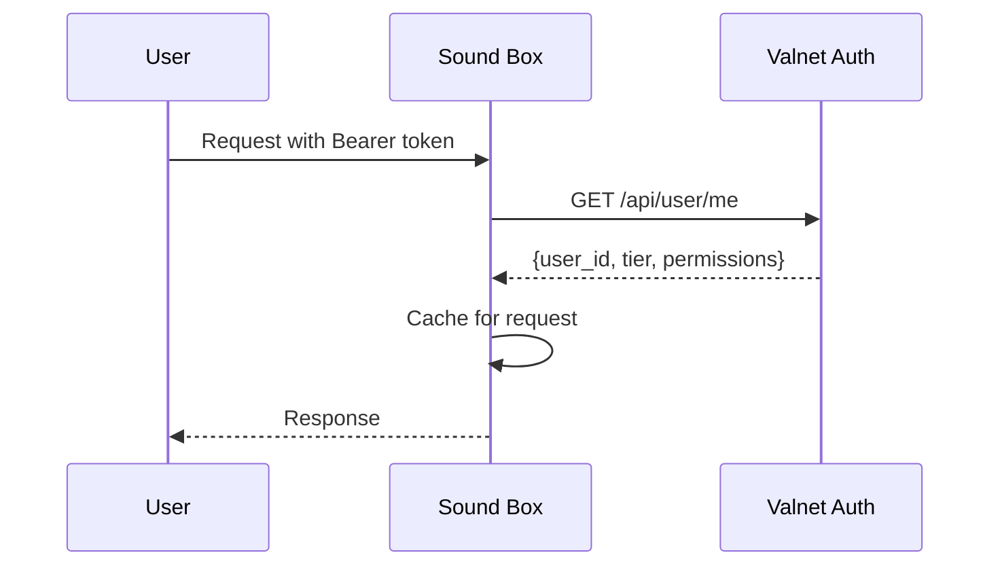

# Authentication System

User authentication and subscription tier management.



## Overview

Sound Box uses Valnet/Graphlings for authentication:
- **No local accounts** - All users from external auth
- **Token-based** - Bearer tokens in Authorization header
- **Tier-aware** - Subscription tier affects limits

---

## Authentication Flow

### Token Validation

```python
def validate_token(token):
    """Validate token with Valnet."""
    response = requests.get(
        f'{ACCOUNTS_URL}/api/user/me',
        headers={'Authorization': f'Bearer {token}'},
        timeout=5
    )

    if response.status_code == 200:
        return response.json()  # User data
    return None
```

### Request Decorators

```python
@require_auth
def protected_endpoint():
    """Requires valid token."""
    user = request.user  # Available after auth
    user_id = request.user_id
    # ...

@optional_auth
def semi_protected():
    """Works with or without token."""
    if request.user_id:
        # Authenticated user
    else:
        # Anonymous user

@require_auth_or_localhost
def generation_endpoint():
    """Auth required, but localhost bypasses for batch scripts."""
    # ...
```

---

## User Tiers

### Tier Hierarchy

| Tier | Priority | Price | Source |
|------|----------|-------|--------|
| Admin | 0 | - | `is_admin` flag |
| Creator | 1 | $20/mo | ai-graphling-monthly |
| Premium | 2 | $10/mo | premium-monthly |
| Supporter | 3 | $5/mo | supporter-monthly |
| Free | 4 | $0 | No subscription |

### Tier Detection

```python
def get_user_tier(user):
    """Determine tier from user data."""
    if not user:
        return None  # Not authenticated

    # Admin check
    if user.get('is_admin'):
        return 'creator'

    # Subscription tier (Valnet sets this)
    tier = user.get('subscription_tier') or user.get('tier')
    if tier:
        tier_lower = tier.lower()
        if tier_lower in ('creator', 'ai-graphling'):
            return 'creator'
        if tier_lower in ('premium', 'pro'):
            return 'premium'
        if tier_lower in ('supporter', 'plus'):
            return 'supporter'

    # Check subscription object
    sub = user.get('subscription', {})
    if isinstance(sub, dict) and sub.get('status') in ('active', 'trialing'):
        plan_id = sub.get('plan_id', '').lower()
        if 'ai-graphling' in plan_id:
            return 'creator'
        if 'premium' in plan_id:
            return 'premium'
        if 'supporter' in plan_id:
            return 'supporter'

    return 'free'
```

---

## Tier Limits

### Generation Limits

| Tier | Per Hour | Max Duration | Pending Jobs |
|------|----------|--------------|--------------|
| Creator | 60 | 180s | 20 |
| Premium | 30 | 120s | 10 |
| Supporter | 15 | 60s | 5 |
| Free | 2 | 30s | 2 |

### TTS Limits

| Tier | Per Hour |
|------|----------|
| Creator | 120 |
| Premium | 60 |
| Supporter | 30 |
| Free | 10 |

### Storage Limits

| Tier | Private Generations |
|------|---------------------|
| Creator | 500 |
| Premium | 200 |
| Supporter | 100 |
| Free | 20 |

---

## Rate Limiting

### Per-Endpoint Limits

```python
from flask_limiter import Limiter

limiter = Limiter(
    app,
    key_func=get_remote_address,
    default_limits=["200 per day"]
)

@app.route('/generate', methods=['POST'])
@limiter.limit("60 per hour")  # Base limit
def generate():
    # Tier-specific limits checked in handler
    tier = get_user_tier(request.user)
    limit = GENERATION_LIMITS[tier]['per_hour']
    # ...
```

### Limit Responses

```json
{
  "error": "Rate limit exceeded. You can generate 30 per hour with Premium."
}
```

Headers included:
```
X-RateLimit-Limit: 30
X-RateLimit-Remaining: 0
X-RateLimit-Reset: 1609459200
```

---

## Email Verification

Free users must verify email before generating.

### Verification Check

```python
def is_email_verified(user):
    """Check if user has verified email."""
    if not user:
        return False

    # Direct verified flag
    if user.get('email_verified'):
        return True

    # OAuth users have verified emails
    if user.get('auth_provider') in ('google', 'oauth'):
        return True

    # Account tier includes verification
    tier = user.get('account_tier', '')
    if tier.lower() in ('verified', 'email_verified', 'oauth_verified'):
        return True

    return False
```

### Bypass for Paid Users

```python
# Paid users skip email verification
if user_tier in ('creator', 'premium', 'supporter'):
    pass  # Allow without verification
elif not is_email_verified(user):
    return error("Please verify your email to generate audio")
```

---

## Aura (Virtual Currency)

### Spending Aura

```python
def spend_aura(token, amount, description, job_id=None):
    """Deduct Aura from user's wallet."""
    response = requests.post(
        f'{ACCOUNTS_URL}/api/wallet/spend',
        headers={'Authorization': f'Bearer {token}'},
        json={
            'amount': amount,
            'currency': 'aura',
            'item': description,
            'app_id': 'soundbox',
            'metadata': {'job_id': job_id}
        }
    )

    if response.status_code == 200:
        return {
            'success': True,
            'new_balance': response.json().get('new_balance')
        }
    return {'success': False, 'error': response.json().get('detail')}
```

### Use Cases

- Queue skipping (1-15 Aura based on duration)
- Future: Premium features, longer generations

---

## Security Considerations

### Token Handling

- Tokens never stored server-side
- Validation on every protected request
- Short timeout on auth calls (5s)

### CORS

```python
CORS(app, origins=[
    'https://graphlings.net',
    'https://soundbox.example.com'
])
```

### Headers

```python
@app.after_request
def add_security_headers(response):
    response.headers['X-Content-Type-Options'] = 'nosniff'
    response.headers['X-Frame-Options'] = 'SAMEORIGIN'
    response.headers['X-XSS-Protection'] = '1; mode=block'
    return response
```

---

## Debugging

### Check User Tier

```bash
# Get user info from token
curl -H "Authorization: Bearer $TOKEN" \
    https://accounts.example.com/api/user/me | jq
```

### Test Rate Limits

```bash
# Check remaining quota
curl -I http://localhost:5309/generate \
    -H "Authorization: Bearer $TOKEN"

# Look for X-RateLimit-* headers
```

### Common Issues

| Issue | Cause | Fix |
|-------|-------|-----|
| 401 Unauthorized | Invalid/expired token | Re-authenticate |
| 403 Forbidden | Email not verified | Verify email or upgrade |
| 429 Too Many Requests | Rate limit hit | Wait or upgrade tier |

---

## See Also

- [API Reference](../api/README.md) - Authentication in API docs
- [Queue System](queue-system.md) - Priority by tier
- [Architecture](../ARCHITECTURE.md) - System overview

---

[← Back to Documentation](../README.md)
