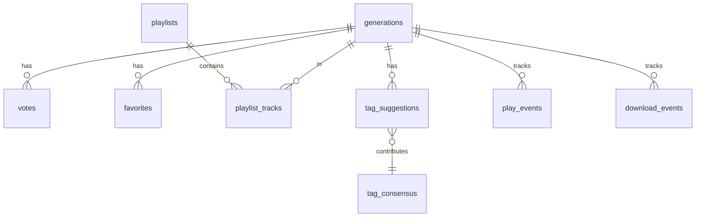
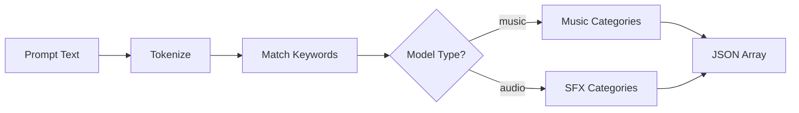
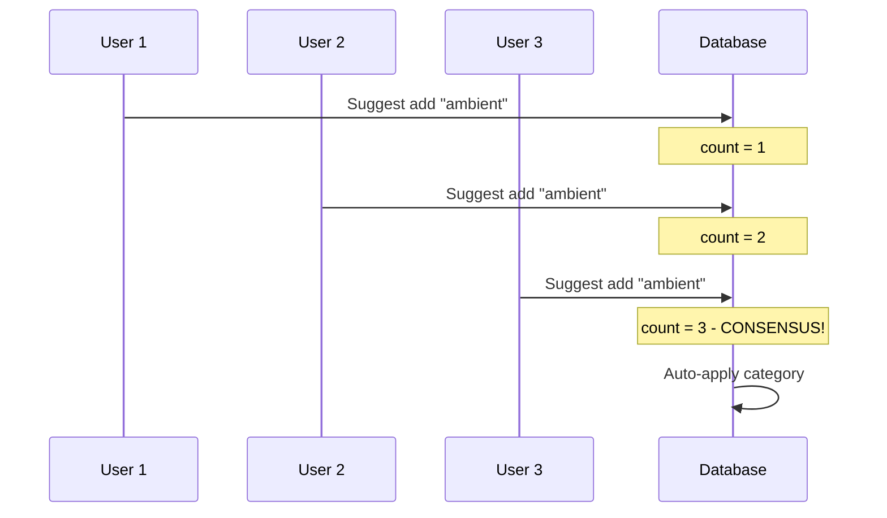

# Database System

SQLite database with FTS5 full-text search and auto-categorization.



## Overview

Sound Box uses SQLite for:
- **Simplicity** - No external database server
- **FTS5** - Built-in full-text search
- **ACID** - Reliable transactions
- **Portability** - Single file backup

Database location: `soundbox.db`

---

## Schema

### Generations Table

Main table storing all generated audio metadata.

```sql
CREATE TABLE generations (
    id TEXT PRIMARY KEY,           -- UUID
    filename TEXT NOT NULL UNIQUE, -- e.g., "abc123.wav"
    prompt TEXT NOT NULL,          -- User's text prompt
    model TEXT NOT NULL,           -- "music", "audio", "voice"
    duration INTEGER NOT NULL,     -- Seconds
    category TEXT,                 -- JSON array of categories
    user_id TEXT,                  -- Owner (nullable for anonymous)
    is_public BOOLEAN DEFAULT 1,   -- Visible in library
    created_at TIMESTAMP DEFAULT CURRENT_TIMESTAMP,
    upvotes INTEGER DEFAULT 0,     -- Denormalized count
    downvotes INTEGER DEFAULT 0    -- Denormalized count
);
```

### Votes Table

User votes with private feedback.

```sql
CREATE TABLE votes (
    id INTEGER PRIMARY KEY AUTOINCREMENT,
    generation_id TEXT NOT NULL,
    user_id TEXT NOT NULL,
    vote INTEGER NOT NULL,            -- 1, -1, or 0
    feedback_reasons TEXT,            -- JSON array
    feedback_notes TEXT,              -- Private text
    suggested_model TEXT,             -- Optional model suggestion
    created_at TIMESTAMP DEFAULT CURRENT_TIMESTAMP,
    FOREIGN KEY (generation_id) REFERENCES generations(id),
    UNIQUE(generation_id, user_id)
);
```

### Favorites Table

```sql
CREATE TABLE favorites (
    id INTEGER PRIMARY KEY AUTOINCREMENT,
    user_id TEXT NOT NULL,
    generation_id TEXT NOT NULL,
    created_at TIMESTAMP DEFAULT CURRENT_TIMESTAMP,
    FOREIGN KEY (generation_id) REFERENCES generations(id),
    UNIQUE(user_id, generation_id)
);
```

### Playlists

```sql
CREATE TABLE playlists (
    id TEXT PRIMARY KEY,              -- "pl_xxx..."
    user_id TEXT NOT NULL,
    name TEXT NOT NULL,
    description TEXT,
    created_at TIMESTAMP DEFAULT CURRENT_TIMESTAMP,
    updated_at TIMESTAMP DEFAULT CURRENT_TIMESTAMP
);

CREATE TABLE playlist_tracks (
    id INTEGER PRIMARY KEY AUTOINCREMENT,
    playlist_id TEXT NOT NULL,
    generation_id TEXT NOT NULL,
    position INTEGER NOT NULL,
    added_at TIMESTAMP DEFAULT CURRENT_TIMESTAMP,
    FOREIGN KEY (playlist_id) REFERENCES playlists(id),
    FOREIGN KEY (generation_id) REFERENCES generations(id),
    UNIQUE(playlist_id, generation_id)
);
```

### Tag Suggestions (Crowdsourcing)

```sql
CREATE TABLE tag_suggestions (
    id INTEGER PRIMARY KEY AUTOINCREMENT,
    generation_id TEXT NOT NULL,
    user_id TEXT NOT NULL,
    suggested_category TEXT NOT NULL,
    action TEXT NOT NULL DEFAULT 'add',  -- 'add' or 'remove'
    created_at TIMESTAMP DEFAULT CURRENT_TIMESTAMP,
    FOREIGN KEY (generation_id) REFERENCES generations(id),
    UNIQUE(generation_id, user_id, suggested_category, action)
);

CREATE TABLE tag_consensus (
    id INTEGER PRIMARY KEY AUTOINCREMENT,
    generation_id TEXT NOT NULL,
    category TEXT NOT NULL,
    action TEXT NOT NULL DEFAULT 'add',
    suggestion_count INTEGER DEFAULT 1,
    last_updated TIMESTAMP DEFAULT CURRENT_TIMESTAMP,
    FOREIGN KEY (generation_id) REFERENCES generations(id),
    UNIQUE(generation_id, category, action)
);
```

### Analytics

```sql
CREATE TABLE play_events (
    id INTEGER PRIMARY KEY AUTOINCREMENT,
    generation_id TEXT NOT NULL,
    user_id TEXT,
    session_id TEXT,
    played_at TIMESTAMP DEFAULT CURRENT_TIMESTAMP,
    FOREIGN KEY (generation_id) REFERENCES generations(id)
);

CREATE TABLE download_events (
    id INTEGER PRIMARY KEY AUTOINCREMENT,
    generation_id TEXT NOT NULL,
    user_id TEXT,
    downloaded_at TIMESTAMP DEFAULT CURRENT_TIMESTAMP,
    format TEXT DEFAULT 'wav',
    FOREIGN KEY (generation_id) REFERENCES generations(id)
);
```

---

## Full-Text Search

### FTS5 Virtual Table

```sql
CREATE VIRTUAL TABLE generations_fts
USING fts5(prompt, content=generations, content_rowid=rowid);
```

### Sync Triggers

```sql
-- Insert trigger
CREATE TRIGGER generations_ai AFTER INSERT ON generations
BEGIN
    INSERT INTO generations_fts(rowid, prompt)
    VALUES (new.rowid, new.prompt);
END;

-- Update trigger
CREATE TRIGGER generations_au AFTER UPDATE ON generations
BEGIN
    INSERT INTO generations_fts(generations_fts, rowid, prompt)
    VALUES ('delete', old.rowid, old.prompt);
    INSERT INTO generations_fts(rowid, prompt)
    VALUES (new.rowid, new.prompt);
END;

-- Delete trigger
CREATE TRIGGER generations_ad AFTER DELETE ON generations
BEGIN
    INSERT INTO generations_fts(generations_fts, rowid, prompt)
    VALUES ('delete', old.rowid, old.prompt);
END;
```

### Query Sanitization

User input is sanitized to prevent FTS5 injection:

```python
def sanitize_fts5_query(search):
    """Sanitize search input for FTS5."""

    # Remove operators: *, ^, +, -, NOT, AND, OR, NEAR
    clean = re.sub(r'[*^+\-]', '', search)
    clean = re.sub(r'\b(NOT|AND|OR|NEAR)\b', '', clean, re.IGNORECASE)
    clean = clean.replace(':', ' ')

    # Quote each term
    words = clean.strip().split()
    quoted = [f'"{w}"' for w in words if w]

    return ' OR '.join(quoted)
```

### Search Query

```python
def search_library(query):
    sanitized = sanitize_fts5_query(query)
    if not sanitized:
        return []

    return db.execute("""
        SELECT g.* FROM generations g
        JOIN generations_fts fts ON g.rowid = fts.rowid
        WHERE generations_fts MATCH ?
        ORDER BY rank
    """, [sanitized])
```

---

## Category System

### Auto-Categorization

Categories are automatically assigned based on prompt keywords.



### Music Categories (50+)

Organized by type:

| Type | Categories |
|------|------------|
| **Genre** | electronic, rock, jazz, classical, hip-hop, ambient |
| **Mood** | happy, sad, energetic, calm, mysterious, scary |
| **Instrument** | piano, guitar, strings, synth, drums |
| **Style** | cinematic, lofi, retro, orchestral, chiptune |
| **Use Case** | game, trailer, podcast, workout, meditation |

### SFX Categories (30+)

| Type | Categories |
|------|------------|
| **UI** | notification, button, success, error |
| **Action** | explosion, impact, whoosh, footstep |
| **Environment** | nature, weather, urban, indoor |
| **Creature** | monster, animal, voice |
| **Sci-Fi** | laser, robot, spaceship |

### Keyword Matching

```python
MUSIC_CATEGORIES = {
    'electronic': ['electronic', 'synth', 'digital', 'edm'],
    'ambient': ['ambient', 'atmospheric', 'ethereal', 'soundscape'],
    'piano': ['piano', 'keys', 'keyboard', 'grand piano'],
    # ...50+ categories
}

def categorize_prompt(prompt, model):
    categories = []
    prompt_lower = prompt.lower()

    keyword_map = MUSIC_CATEGORIES if model == 'music' else SFX_CATEGORIES

    for category, keywords in keyword_map.items():
        if any(kw in prompt_lower for kw in keywords):
            categories.append(category)

    return categories
```

---

## Crowdsourced Tagging

Users can suggest category changes. When 3+ agree, changes are auto-applied.

### Flow



### Consensus Threshold

```python
CONSENSUS_THRESHOLD = 3  # Votes needed to apply

def check_consensus(gen_id, category, action):
    count = get_suggestion_count(gen_id, category, action)

    if count >= CONSENSUS_THRESHOLD:
        if action == 'add':
            add_category(gen_id, category)
        else:
            remove_category(gen_id, category)
        return True

    return False
```

---

## Indexes

```sql
-- Primary lookups
CREATE INDEX idx_generations_model ON generations(model);
CREATE INDEX idx_generations_created ON generations(created_at DESC);
CREATE INDEX idx_generations_user_id ON generations(user_id);
CREATE INDEX idx_generations_public ON generations(is_public);

-- Votes
CREATE INDEX idx_votes_generation ON votes(generation_id);

-- Favorites
CREATE INDEX idx_favorites_user ON favorites(user_id);
CREATE INDEX idx_favorites_generation ON favorites(generation_id);

-- Tags
CREATE INDEX idx_tag_suggestions_generation ON tag_suggestions(generation_id);
CREATE INDEX idx_tag_suggestions_category ON tag_suggestions(suggested_category);

-- Analytics
CREATE INDEX idx_play_events_generation ON play_events(generation_id);
CREATE INDEX idx_play_events_user ON play_events(user_id);
```

---

## Migrations

### Adding Columns

```python
def migrate_add_column():
    """Add new column safely."""
    try:
        conn.execute("ALTER TABLE generations ADD COLUMN plays INTEGER DEFAULT 0")
    except sqlite3.OperationalError:
        pass  # Column exists
```

### Migrating from JSON

Historical data was stored in `generations.json`. Migration:

```python
def migrate_from_json():
    """One-time migration from JSON to SQLite."""
    if not os.path.exists('generations.json'):
        return 0

    with open('generations.json') as f:
        data = json.load(f)

    for gen_id, meta in data.items():
        insert_generation(gen_id, meta)

    os.rename('generations.json', 'generations.json.bak')
    return len(data)
```

---

## Connection Management

```python
@contextmanager
def get_db():
    """Get database connection with auto-commit/rollback."""
    conn = sqlite3.connect(DB_PATH)
    conn.row_factory = sqlite3.Row

    try:
        yield conn
        conn.commit()
    except Exception:
        conn.rollback()
        raise
    finally:
        conn.close()
```

Usage:
```python
with get_db() as conn:
    conn.execute("INSERT INTO ...", [...])
    # Auto-commits on success
```

---

## Backup

Database is backed up using SQLite's backup API:

```python
def backup_database(dest_path):
    """Safe backup while database is in use."""
    src = sqlite3.connect(DB_PATH)
    dst = sqlite3.connect(dest_path)

    src.backup(dst)

    dst.close()
    src.close()
```

This is safe to run while the server is active.

---

## Performance Tips

### Query Optimization

```python
# Good - uses index
SELECT * FROM generations
WHERE model = 'music'
ORDER BY created_at DESC
LIMIT 20

# Bad - full table scan
SELECT * FROM generations
WHERE prompt LIKE '%piano%'  # Use FTS instead!
```

### Denormalized Counts

Vote counts are stored directly on generations:

```python
# After vote
UPDATE generations
SET upvotes = upvotes + 1
WHERE id = ?
```

Avoids COUNT(*) queries for every list view.

---

## CLI Commands

```bash
# Initialize database
python database.py init

# Migrate from JSON
python database.py migrate

# Show statistics
python database.py stats

# Re-categorize all generations
python database.py recategorize
```

---

## See Also

- [Library API](../api/library.md) - Query the database
- [Architecture](../ARCHITECTURE.md) - System overview
- [Backup](../operations/backup.md) - Backup procedures

---

[← Back to Documentation](../README.md)
