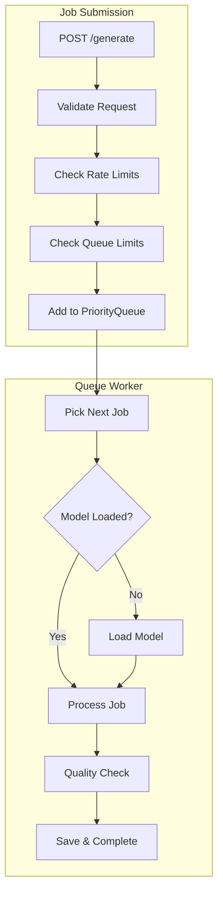
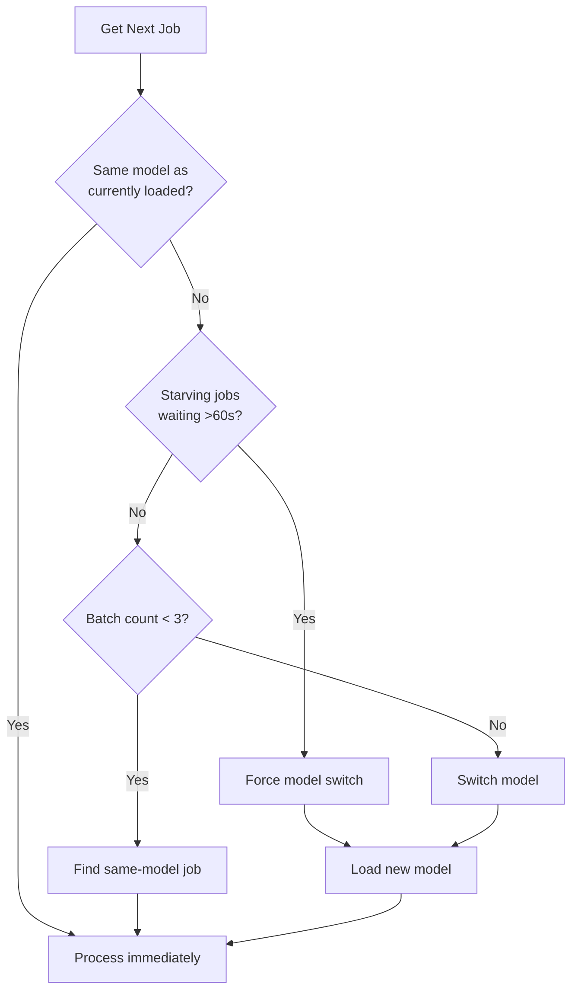
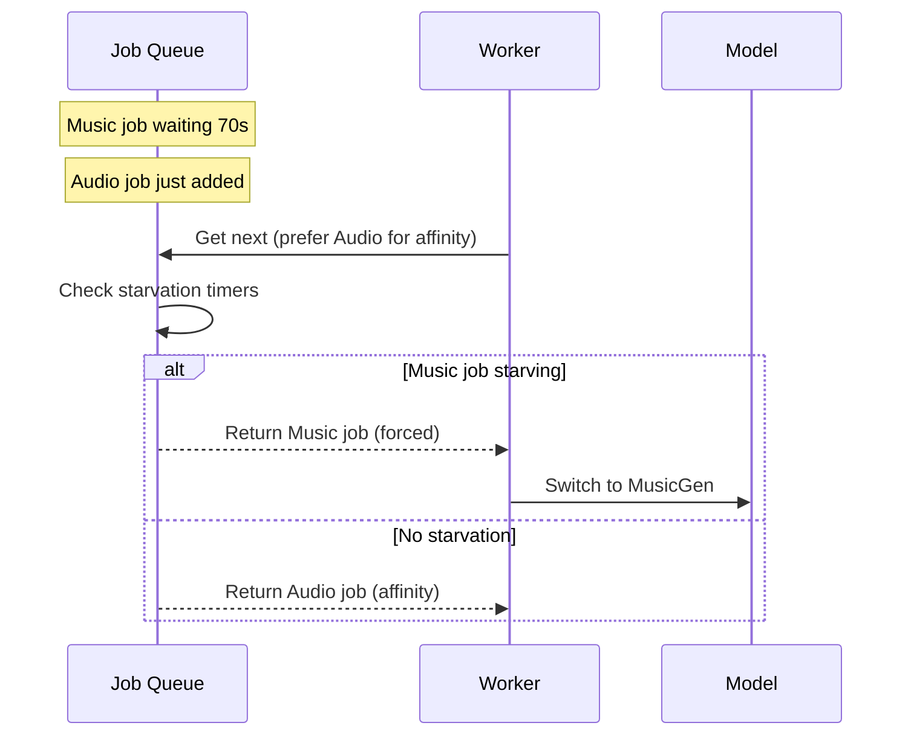
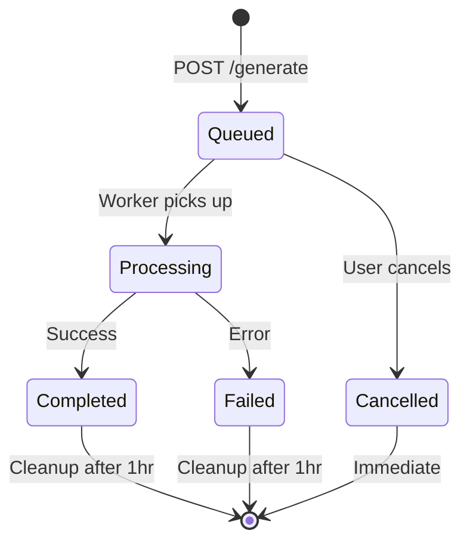

# Queue System

Priority-based job scheduling with model affinity and starvation prevention.



## Priority Levels

Jobs are processed by subscription tier:

| Priority | Tier | Price | Description |
|----------|------|-------|-------------|
| 0 | Admin | - | System operators |
| 1 | Creator | $20/mo | Highest paying tier |
| 2 | Premium | $10/mo | Mid tier |
| 3 | Supporter | $5/mo | Basic paid |
| 4 | Free | $0 | Non-paying users |

**Lower number = higher priority**

Within the same priority level, jobs are processed FIFO (first-in, first-out).

---

## Tier Limits

Each tier has specific limits on queue usage:

| Tier | Pending Jobs | Gens/Hour | Max Duration |
|------|--------------|-----------|--------------|
| Creator | 20 | 60 | 180s |
| Premium | 10 | 30 | 120s |
| Supporter | 5 | 15 | 60s |
| Free | 2 | 3 | 30s |

### Limit Enforcement

```python
# Check before accepting new job
if count_user_pending_jobs(user_id) >= MAX_PENDING_PER_USER[tier]:
    return error("Queue limit reached for your tier")

if duration > GENERATION_LIMITS[tier]['max_duration']:
    return error("Duration exceeds your tier limit")
```

---

## Model Affinity

The queue worker optimizes for minimal model switching.



### Why Affinity Matters

Loading a model takes 2-5 seconds and consumes GPU memory. Batching same-model jobs:
- Reduces average wait time
- Avoids memory thrashing
- Improves throughput

### Batch Limits

| Setting | Value | Purpose |
|---------|-------|---------|
| Max Batch Size | 3 | Prevent extreme unfairness |
| Starvation Timeout | 60s | Force model switch for waiting jobs |

---

## Starvation Prevention

Prevents lower-priority jobs from waiting forever.

### Per-Tier Timeouts

```python
STARVATION_TIMEOUT_BY_TIER = {
    'admin': 30,      # 30 seconds
    'creator': 45,
    'premium': 60,
    'supporter': 90,
    'free': 120       # 2 minutes max wait
}
```

### How It Works



---

## Queue Skip (Aura)

Users can pay to skip to the front.

### Pricing

| Duration | Cost | Label |
|----------|------|-------|
| 1-10s | 1 Aura | Short SFX |
| 11-30s | 3 Aura | Medium clip |
| 31-60s | 5 Aura | Long SFX |
| 61-120s | 10 Aura | Song |
| 121s+ | 15 Aura | Long song |

### Implementation

```python
# When user skips
job['priority'] = 'skipped'
job['priority_num'] = -1  # Higher than admin (0)
job['skipped'] = True
job['skip_cost'] = calculated_cost
```

Skipped jobs:
- Move to absolute front of queue
- Bypass all priority levels
- Still respect currently-processing job

---

## Job Lifecycle



### Job States

| State | Description |
|-------|-------------|
| `queued` | Waiting in queue |
| `processing` | Currently generating |
| `completed` | Generation finished |
| `failed` | Error occurred |
| `cancelled` | User cancelled |

### State Transitions

- `queued → processing`: Worker picks up job
- `queued → cancelled`: User calls cancel API
- `processing → completed`: Generation succeeded
- `processing → failed`: Error during generation

---

## Thread Safety

All queue operations are protected by locks:

```python
queue_lock = threading.Lock()  # Protects jobs dict
model_lock = threading.Lock()  # Protects model loading

# Example usage
with queue_lock:
    job = jobs[job_id]
    job['status'] = 'processing'
```

### Critical Sections

| Lock | Protects |
|------|----------|
| `queue_lock` | `jobs` dict, state changes, position calculations |
| `model_lock` | Model loading, unloading, status changes |

---

## Job Cleanup

Completed jobs are removed after 1 hour to prevent memory exhaustion.

```python
def cleanup_old_jobs():
    """Remove completed/failed jobs after 1 hour."""

    for job_id, job in jobs.items():
        if job['status'] in ('completed', 'failed'):
            age = (now - job['completed']).total_seconds()
            if age > 3600:  # 1 hour
                del jobs[job_id]
```

Cleanup runs every 5 minutes.

---

## Queue Status API

### Public Status

`GET /queue-status` - Basic info for users:

```json
{
  "queue_length": 5,
  "current_job": "abc123",
  "jobs": [
    {"id": "...", "status": "processing", "model": "music", "position": 1}
  ]
}
```

### Detailed Status

`GET /api/queue` - Full info for queue explorer:

```json
{
  "jobs": [
    {
      "id": "abc123",
      "status": "processing",
      "model": "music",
      "duration": 30,
      "priority": "premium",
      "progress": "Generating... 45%",
      "progress_pct": 45,
      "position": 1
    }
  ],
  "total": 5
}
```

---

## Scheduler Info

`GET /status` includes scheduler details:

```json
{
  "scheduler": {
    "last_model_used": "audio",
    "batch_count": 2,
    "max_batch_size": 3,
    "starvation_timeouts": {
      "admin": 30,
      "creator": 45,
      "premium": 60,
      "supporter": 90,
      "free": 120
    }
  }
}
```

---

## Estimated Wait Times

The API provides per-model wait estimates:

```python
def estimate_wait(model):
    """Estimate wait time in seconds for new job."""

    jobs_ahead = count_jobs_by_model(model)
    avg_time_per_job = get_avg_generation_time(model)

    return jobs_ahead * avg_time_per_job
```

Response includes:
```json
{
  "estimated_wait": {
    "music": 90,
    "audio": 45
  }
}
```

---

## Debugging

### Check Queue State

```bash
# Get detailed queue status
curl http://localhost:5309/api/queue | jq

# Check system status
curl http://localhost:5309/status | jq '.scheduler'
```

### Common Issues

| Symptom | Likely Cause | Fix |
|---------|--------------|-----|
| Jobs stuck in queue | Model loading failed | Check GPU memory |
| Long wait times | Too many same-model jobs | Normal - affinity batching |
| Skipped jobs not processing | Already processing different job | Wait for current job |
| "Queue is full" error | 100 jobs limit reached | Wait or increase limit |

---

## Configuration

Settings in `app.py`:

```python
MAX_QUEUE_SIZE = 100        # Total jobs allowed
_MAX_BATCH_SIZE = 3         # Same-model batch limit
_JOB_MAX_AGE_SECONDS = 3600 # Cleanup after 1 hour
_JOB_CLEANUP_INTERVAL = 300 # Check every 5 minutes

STARVATION_TIMEOUT_BY_TIER = {
    'admin': 30,
    'creator': 45,
    'premium': 60,
    'supporter': 90,
    'free': 120
}
```

---

## See Also

- [Audio Generation](audio-generation.md) - Model details
- [Generation API](../api/generation.md) - API reference
- [Architecture](../ARCHITECTURE.md) - System overview

---

[← Back to Documentation](../README.md)
