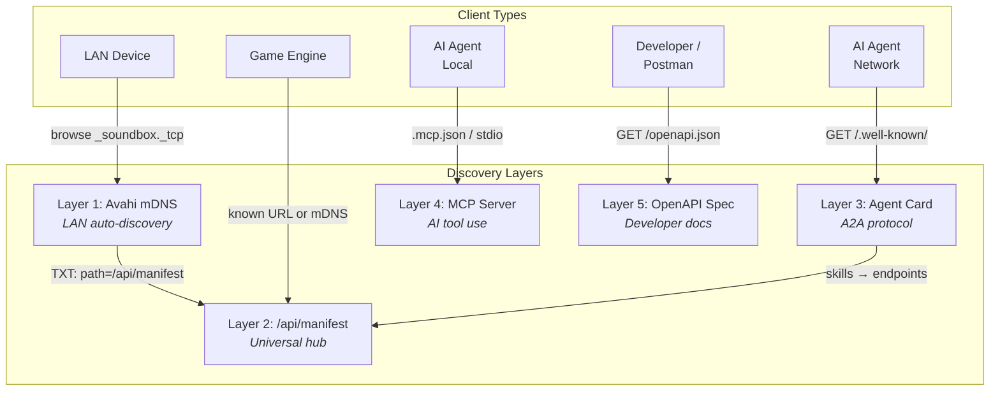
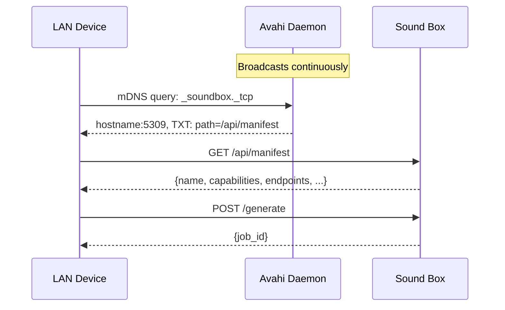
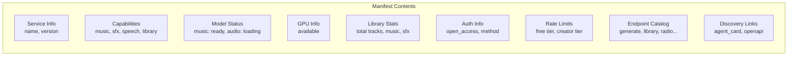
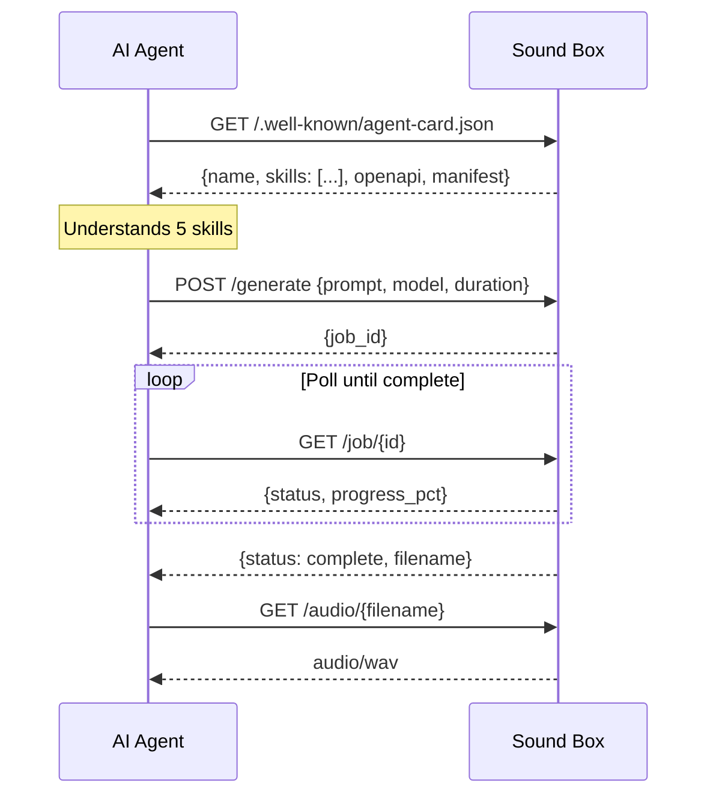
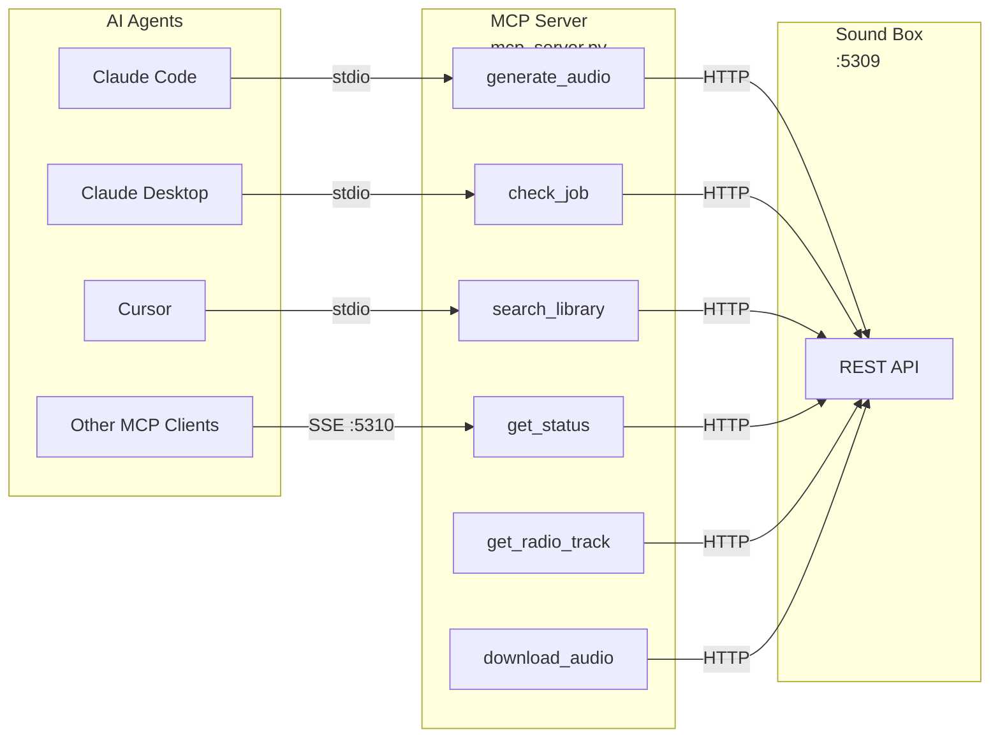
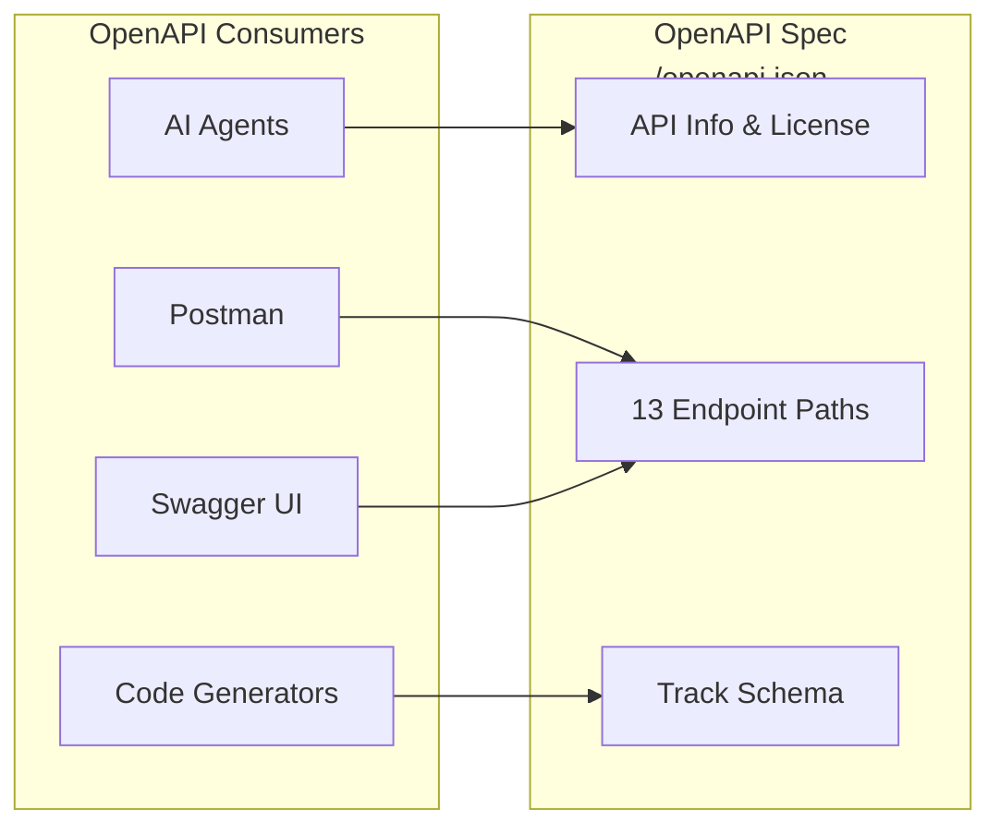
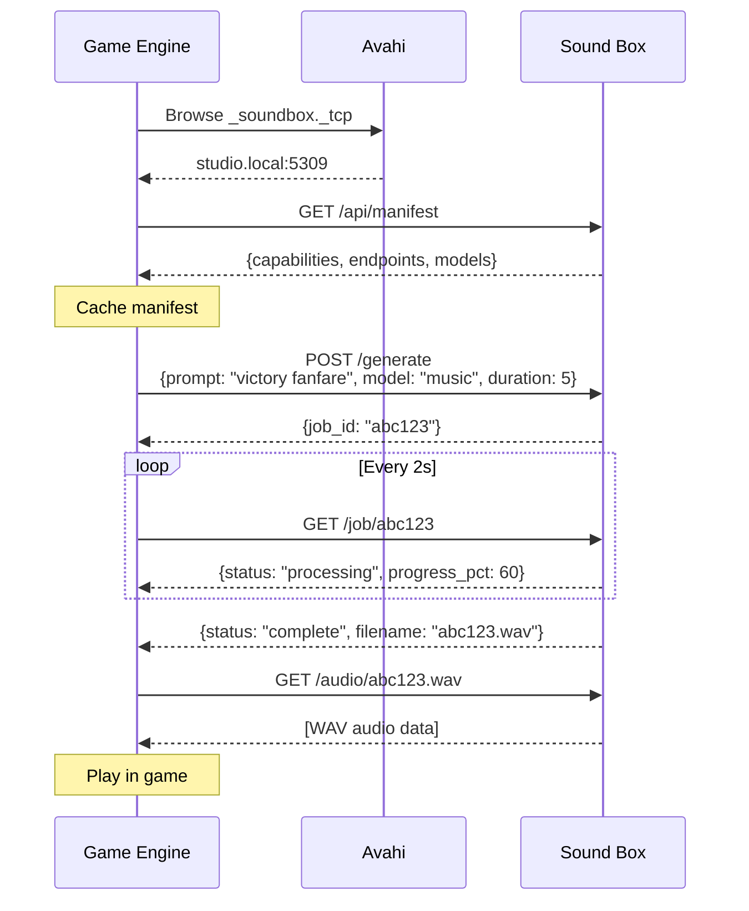
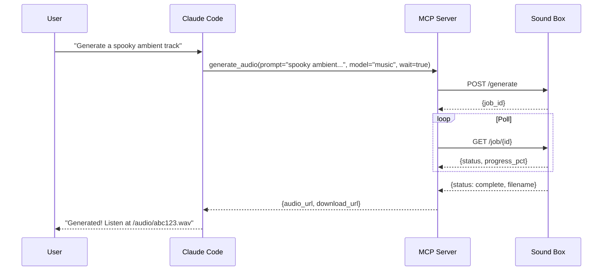

# Service Discovery

How other applications, AI agents, and LAN devices find and interact with Sound Box.



## Overview

Sound Box provides 5 complementary discovery mechanisms. Each serves a different type of client, but they all point back to the same REST API.

| Layer | Path / Protocol | Client Type | How It Works |
|-------|----------------|-------------|--------------|
| **Avahi mDNS** | `_soundbox._tcp` | LAN devices | Zero-config broadcast on local network |
| **Manifest** | `GET /api/manifest` | Any HTTP client | JSON hub with capabilities, endpoints, stats |
| **Agent Card** | `GET /.well-known/agent-card.json` | AI agents (A2A) | Skills list per Google A2A protocol |
| **MCP Server** | stdio or SSE `:5310` | Claude Code, Cursor, etc. | Direct tool invocation from AI agents |
| **OpenAPI** | `GET /openapi.json` | Developers, Postman | Machine-readable API spec (3.1) |

---

## Layer 1: Avahi mDNS (LAN Auto-Discovery)

Any device on the local network discovers Sound Box automatically without knowing its IP address.



### Service File

**File:** `avahi/soundbox.service`

Broadcasts two service types:
- `_http._tcp` - Generic HTTP service (any mDNS client finds it)
- `_soundbox._tcp` - Sound Box-specific (targeted discovery)

Both include TXT records pointing to `/api/manifest`.

### Installation

Installed automatically by `./service.sh install`, which copies the XML to `/etc/avahi/services/`.

### Testing

```bash
# Discover on LAN
avahi-browse _soundbox._tcp -t

# Resolve to IP + port
avahi-resolve -n $(hostname).local
```

---

## Layer 2: `/api/manifest` (Universal Discovery Hub)

The central discovery endpoint that all other layers point to. Returns everything a client needs to understand and use the API.



### Response Structure

```json
{
  "name": "Sound Box",
  "description": "AI audio generation server...",
  "version": "1.0.0",
  "base_url": "http://studio.local:5309",
  "capabilities": ["music_generation", "sfx_generation", "speech_synthesis",
                    "audio_library", "radio_streaming", "playlists"],
  "models": {
    "music": "ready",
    "audio": "ready",
    "magnet-music": "unloaded",
    "magnet-audio": "unloaded"
  },
  "gpu": {"available": true},
  "library": {"total_tracks": 1247, "total_music": 892, "total_sfx": 355},
  "auth": {"open_access": true, "method": "anonymous_ip"},
  "rate_limits": {
    "free_tier": "10 generations/hour, 60s max duration",
    "creator_tier": "60 generations/hour, 180s max duration (whitelisted IPs)"
  },
  "endpoints": {
    "generate": {"method": "POST", "path": "/generate"},
    "job_status": {"method": "GET", "path": "/job/{job_id}"},
    "library": {"method": "GET", "path": "/api/library"},
    "...": "..."
  },
  "discovery": {
    "manifest": "/api/manifest",
    "agent_card": "/.well-known/agent-card.json",
    "openapi": "/openapi.json"
  }
}
```

> **Note:** The manifest intentionally omits `hostname`, `gpu.name`, and `mcp_port` to avoid leaking system details. Full GPU info is available via `GET /status`.

### Use Cases

- **Game engine**: Fetch manifest to learn available endpoints, then generate audio on demand
- **Home automation**: Check model status before submitting jobs
- **Monitoring**: Poll manifest for library stats and model health

---

## Layer 3: Agent Card (A2A Protocol)

Follows Google's [Agent-to-Agent (A2A) protocol](https://github.com/google/A2A) for AI agent discovery. Any agent that supports A2A can discover Sound Box's capabilities at the well-known path.



### Skills

| Skill ID | Description | Endpoint |
|----------|-------------|----------|
| `generate-music` | Generate music from text prompt | `POST /generate` |
| `generate-sfx` | Generate sound effects from text prompt | `POST /generate` |
| `search-library` | Search and browse audio library | `GET /api/library` |
| `check-status` | Get GPU status, models, queue | `GET /status` |
| `get-radio-track` | Get random/curated tracks | `GET /api/radio/shuffle` |

Each skill includes example prompts and endpoint details.

---

## Layer 4: MCP Server (Direct AI Tool Use)

A separate process that wraps Sound Box endpoints as MCP (Model Context Protocol) tools. AI agents can invoke these tools directly during conversations.



### Transport Modes

| Mode | Port | Use Case | Config |
|------|------|----------|--------|
| **stdio** | — | Local AI agents (Claude Code, Cursor) | `.mcp.json` |
| **SSE** | 5310 | Network AI agents, remote tools | `MCP_PORT` env var |

### Tools

#### `generate_audio`
Submit a generation job. Optionally blocks until complete.

```
Args:
  prompt: "upbeat electronic music with synth pads"
  model: "music" | "audio" | "magnet-music" | "magnet-audio"
  duration: 1-60 (default 8)
  wait: true/false (default false)
  poll_interval: seconds between polls (default 3)
  max_wait: timeout in seconds (default 120)

Returns:
  {job_id, status, audio_url, download_url}
```

#### `check_job`
Poll a job's status.

#### `search_library`
Search by keyword, model type, category, with pagination.

#### `get_status`
System status: GPU info, model states, queue length.

#### `get_radio_track`
Get random tracks for discovery or playlist building.

#### `download_audio`
Get stream/download URLs for a specific track by ID.

### Configuration

**Claude Code** auto-discovers via `.mcp.json` in the project root:

```json
{
  "mcpServers": {
    "soundbox": {
      "command": "./venv/bin/python",
      "args": ["mcp_server.py"],
      "env": {"SOUNDBOX_URL": "http://localhost:5309"}
    }
  }
}
```

### Running the MCP Server

```bash
# stdio (for local AI agents - this is what .mcp.json uses)
venv/bin/python mcp_server.py

# SSE (for network AI agents)
venv/bin/python mcp_server.py --transport sse --port 5310

# systemd (installed by ./service.sh install)
sudo systemctl status soundbox-mcp
```

### MCP Security

The MCP server has several security hardening measures:

| Measure | Description |
|---------|-------------|
| **SSE localhost binding** | SSE transport binds to `127.0.0.1` only; use a reverse proxy for network access |
| **MCP_API_KEY** | Required for SSE connections (Bearer token auth); stdio is always trusted |
| **X-MCP-Proxy header** | All MCP→Flask requests include `X-MCP-Proxy: true`; Flask denies localhost privileges to these requests |
| **Input validation** | Job/track IDs validated against `^[a-fA-F0-9]{8,64}$` regex (prevents path traversal) |
| **Parameter clamping** | duration: 1-60, page: 1-1000, per_page: 1-100, count: 1-50 |
| **Manifest redaction** | `/api/manifest` hides hostname, GPU model name, and MCP port |

```bash
# Test MCP_API_KEY requirement (SSE)
curl -s http://localhost:5310/ -H "Authorization: Bearer wrong-key"
# → Connection rejected

# Verify X-MCP-Proxy effect (MCP-proxied requests don't get localhost exemption)
curl -s http://localhost:5309/status -H "X-MCP-Proxy: true"
# → Rate limited under 'mcp-proxy' identity
```

---

## Layer 5: OpenAPI Spec (Developer Documentation)

Machine-readable API specification at `/openapi.json`. Covers the 13 most important external-facing endpoints.



### Documented Endpoints

| Path | Method | Operation |
|------|--------|-----------|
| `/generate` | POST | Submit generation job |
| `/job/{job_id}` | GET | Check job status |
| `/status` | GET | System status |
| `/api/library` | GET | Search/browse library |
| `/api/library/{gen_id}` | GET | Get single track |
| `/api/library/{gen_id}/vote` | POST | Vote on track |
| `/api/radio/shuffle` | GET | Random tracks |
| `/audio/{filename}` | GET | Stream audio |
| `/download/{filename}` | GET | Download audio |
| `/api/stats` | GET | Database statistics |
| `/api/favorites/{gen_id}` | POST/DELETE | Manage favorites |
| `/random-prompt` | POST | Get creative prompt |
| `/api/manifest` | GET | Service manifest |

### Testing

```bash
# Verify spec is valid
curl -s http://localhost:5309/openapi.json | \
  python3 -c "import sys,json; d=json.load(sys.stdin); \
  print(f'OpenAPI {d[\"openapi\"]}: {len(d[\"paths\"])} paths')"
```

---

## Full Discovery Flow Examples

### Game Engine Integration



### AI Agent Workflow (Claude Code)



---

## Service Management

| Action | Command |
|--------|---------|
| Install all services | `./service.sh install` |
| Uninstall all services | `./service.sh uninstall` |
| Check status | `./service.sh status` |
| View logs | `./service.sh logs` |

`service.sh install` sets up:
1. **soundbox** systemd service (Flask on :5309)
2. **soundbox-mcp** systemd service (MCP SSE on :5310)
3. **Avahi mDNS** service file (LAN broadcast)

---

## Verification

```bash
# mDNS broadcast
avahi-browse _soundbox._tcp -t

# Manifest endpoint
curl -s http://localhost:5309/api/manifest | python3 -m json.tool

# Agent card
curl -s http://localhost:5309/.well-known/agent-card.json | python3 -m json.tool

# OpenAPI spec
curl -s http://localhost:5309/openapi.json | python3 -m json.tool

# MCP tools (stdio)
echo '{"jsonrpc":"2.0","method":"initialize","params":{"protocolVersion":"2024-11-05","capabilities":{},"clientInfo":{"name":"test","version":"1.0"}},"id":1}' | \
  venv/bin/python mcp_server.py 2>/dev/null | head -1

# Playwright tests (18 tests)
npx playwright test tests/discovery.spec.js
```

---

## See Also

- [Architecture](../ARCHITECTURE.md) - System overview with discovery layer
- [API Reference](../api/README.md) - Complete endpoint documentation
- [Deployment](../operations/deployment.md) - Production setup with service.sh
- [Authentication](authentication.md) - Auth flow and Open Access Mode

---

[← Back to Documentation](../README.md)
